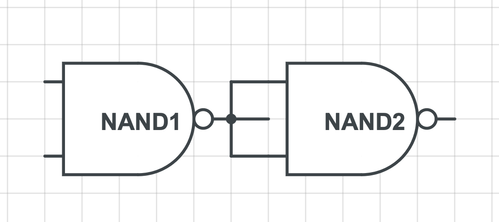

# Exercise 1

# Exercise 2
| a   | b   | c   | F   | G   |
| --- | --- | --- | --- | --- |
| 0   | 0   | 0   | 0   | 1   |
| 1   | 0   | 0   | 0   | 0   |
| 1   | 1   | 0   | 1   | 1   |
| 1   | 1   | 1   | 1   | 0   |
| 1   | 0   | 1   | 1   | 0   |
| 0   | 1   | 1   | 1   | 0   |
| 0   | 0   | 1   | 1   | 0   |

# Exercise 3

# Exercise 4
$\neg(A \vee B) \wedge C$ 

# Exercise 5

# Exercise 6
| Code ID | Code |
| ------- | ---- |
| 1       | 0000 |
| 2       | 0001 |
| 3       | 0011 |
| 4       | 0111 |
| 5       | 1111 |
| 6       | 1011 |
| 7       | 1001 |
| 8       | 1101 |
| 9       | 1100 |
| 10      | 1000 |
| 11      | 1010 |
| 12      | 0010 |
| 13      | 0110 |
| 14      | 0100 |
| 15      | 0101 |
| 16      | 1101 |

# Exercise 7

# Exercise 8

# Exercise 9

# Exercise 10

# Exercise 11

# Exercise 12

