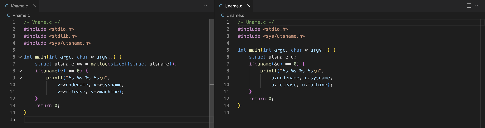

## Assignment 1:
The raspberry pi is a standalone mini computer. It can be used similarly to a normal desktop computer. It can be used for a ton of personal projects and smaller projects. An example of such a project is an automatic greenhouse. Here, trough sensors, the pi would measure humidity of the air and ground, and change conditions based on these readings. This could be by watering the ground to increase humidity, or open a window by a rotor to decrease the humidity in the air. Since we need a constant physical connection to the sensors, a raspberry pi is the ideal candidate for such a project.


## Assignment 2:
The kit is complete. Next to this kit, I bought nothing. I already had the recommended materials myself. These included:
- A spare thumb drive
- A connection to an ethernet cable
- An SD reader

## Assignment 3: *Install a Linux environment on your Laptop computer as well*
My main laptop is running MacOS. This means that only homebrew needed to be installed. This was done by the command:
```
/bin/bash -c "$(curl -fsSL https://raw.githubusercontent.com/Homebrew/install/HEAD/install.sh)"
```

The command needed sudo permissions so that was provided.

## Assignment 4: *Download Raspberry Pi OS and prepare your SD card*
The SSH server was enabled and it is password protected. The username of the pi was changed to be a more personal one. Next to that, I have changed hostname to 'blueberry'. The timezone was already configured correctly and the keyboard did not need a different setup either.


## Assignment 5: *Prepare the network, boot the Pi and login for the first time*
Trying to connect to the pi over Eduroam create a problem for me. It stated that I could not share my internet since Eduroam was protected by 802.1X. To solve this issue, I connected with the open internet 'enschede stad van nu' and that solved the issue. 

I checked if the pi was correctly connected by using `ping blueberry.local`. This returned a ping and afterwards, I used SSH, `AaronPi@blueberry.local`, to log into the pi.


## **TODO** Assignment 6: *Get used to the shell on your Pi*
I approached the questions by using the following instructions:
| Question                                                                                             | Instruction                           |
| ---------------------------------------------------------------------------------------------------- | ------------------------------------- |
| How can you search through the last commands you executed for a specific one with a certain keyword? | `Control + R` followed by the keyword |
| How can you rename a directory?                                                                      | `mv oldname newname`                  |
| How can you easily print the number from 1 to 10?                                                    |                                       |
| How can you run a specific command 10 times?                                                         |                                       |
| How can you redirect the output of a command to a file?                                              |                                       |
| How can you find all manual pages that contain a specific keyword?                                   | `man -k <search term>`                |
| How can you measure the time it takes to execute a certain command?                                  |                                       |


## **TODO** Assignment 7: *Get used to reading manual pages*
The difference between a system call and a library call is the following according to the manual page:
*A system call is a function that wraps operations performed by the kernel. A library call include all library functions excluding the system call wrappers.*
This shows that the main difference between the two is that a system call is a request by the program to enter the kernel, whereas a library call is a call to access the functions defined in the library.


## Assignment 8: *Get used to sudo*
having a permanent root access means that everything is allowed. This means that you can make mistakes that alter the entire OS without knowing. Running as a normal user, you have to give your password every time you need a sudo command. This means that you are aware that this might be altering a lot. Next to that, if someone get's access to your account, they have all rights. This is a huge security risk.

Examples of when sudo are needed are the following:
- Altering the fact if a program is allowed to run or not using `chmod`
- Turning the system off using `shutdown`
- Updating the software on the raspberry pi using `apt-get update`
- Viewing system logs using `-g adm more /var/log/syslog`


## Assignment 9: *Update the software on the Raspberry Pi*
To install all the additions, I used the command `sudo apt install` on all the packages. Afterwards, I used `sudo apt full-upgrade`. Compared to the usual, `sudo apt upgrade`, this command also updates any dependencies that the packages need.


## **TODO** Assignment** 10: *LEDs*


## Assignment 11: *Prepare to copy files from your computer to the Pi and vice versa*
To copy the the zip file to the home directory, I used the command `scp intro-files-2022.zip AaronPi@blueberry.local:home `. This copied the zip file into the `~` directory of the raspberry pi under the name 'home'. This was followed by the command `unzip home`. This unzipped the file package and stored it as a directory called 'intro-files'. This directory contained the same C files as the zipped folder.


## Assignment 12: *Find a convenient way for you to edit files on the Pi*
As VsCode is my main editor, I have chosen to connect to the Pi with VsCode. This went really smoothly and I can access all files correctly.


## **TODO** Assignment 13: *Backup*
 

## Assignment 14: *Compile a simple C program on your Pi and your laptop and run it*
I compiled the program using `gcc HelloWorld.c`. This created an output file `a.out`. Looking at this output using `./a.out` gave the desired Hello World to appear on screen.


## Assignment 15: *Get familiar with C*
The output of both programs is: `blueberry Linux 5.15.61-v8+ aarch64`.

Looking at the code next to each other, we see the following:



The main difference is using the dot notation versus the arrow notation. Next to that, the struct created looks different.

To my understanding, the main difference is that in Uname, and the struct points at the memory location. The arrows then retrieve the data from the memory locations. In the Vname, the struct contains an actual object since it is retrieved by using a pointer. The properties of this object can then be accessed using the dot notation.

Both programs have a similar output, consisting of printing nodename, sysname, release and the machine.

## **TODO** Assignment 16: *Syscalls*


## **TODO** Assignment 17: *Monitor processes on the Pi*


## **TODO** Assignment 18: *Address space*


## **TODO** Assignment 19: *Stack layout*


## **TODO** Assignment 20: *BenchMem*


## **TODO** Assignment 21: *Creating Processes using Fork*


## **TODO** Assignment 22: *Fork and strace*


## **TODO** Assignment 23: *Using gdb*


## **TODO** Assignment 24: *File permissions*


## **TODO** Assignment 25: *Heap vs. stack (difficult)*
