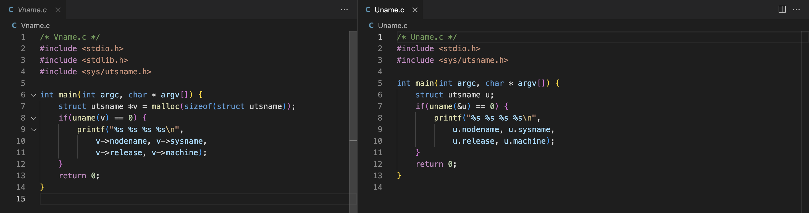
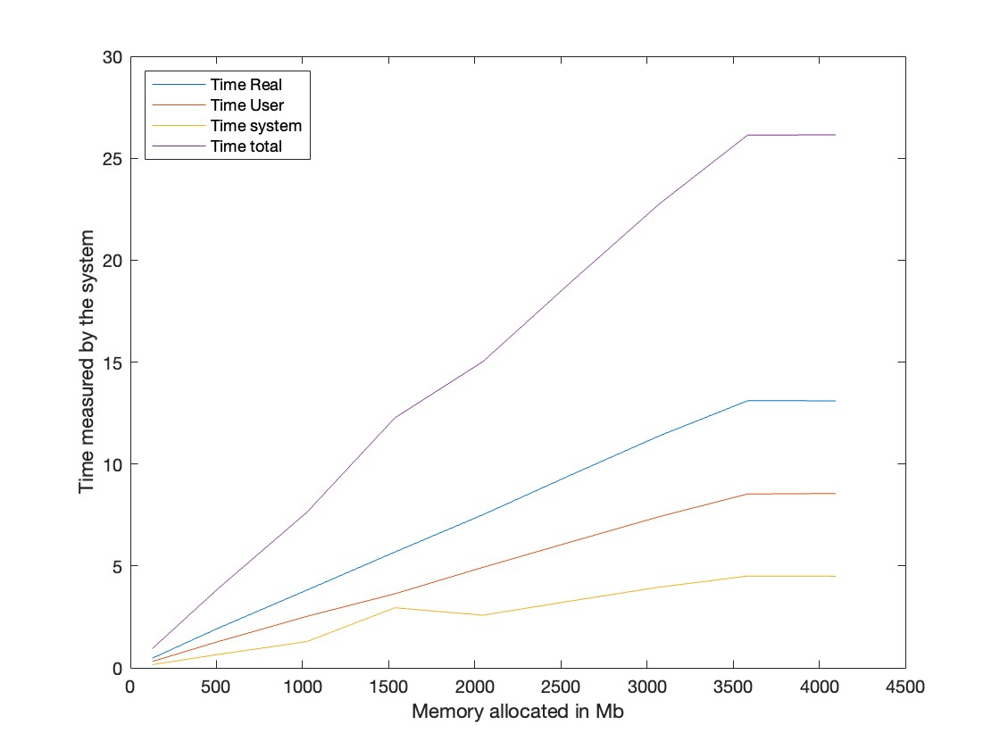

## Assignment 1:*Read about the Raspberry Pi*
The raspberry pi is a standalone mini computer. It can be used similarly to a normal desktop computer. It can be used for a ton of personal projects and smaller projects. An example of such a project is an automatic greenhouse. Here, trough sensors, the pi would measure humidity of the air and ground, and change conditions based on these readings. This could be by watering the ground to increase humidity, or open a window by a rotor to decrease the humidity in the air. Since we need a constant physical connection to the sensors, a raspberry pi is the ideal candidate for such a project.
## Assignment 2:*Get a Raspberry Pi 4 with some accessories*
The kit is complete. Next to this kit, I bought nothing. I already had the recommended materials myself. These included:
- A spare thumb drive
- A connection to an ethernet cable
- An SD reader
## Assignment 3: *Install a Linux environment on your Laptop computer as well*
My main laptop is running MacOS. This mean˚s that only homebrew needed to be installed. This was done by the command:
```
/bin/bash -c "$(curl -fsSL https://raw.githubusercontent.com/Homebrew/install/HEAD/install.sh)"
```

The command needed sudo permissions so that was provided.
## Assignment 4: *Download Raspberry Pi OS and prepare your SD card*
The SSH server was enabled and it is password protected. The username of the pi was changed to be a more personal one. Next to that, I have changed hostname to 'blueberry'. The timezone was already configured correctly and the keyboard did not need a different setup either.
## Assignment 5: *Prepare the network, boot the Pi and login for the first time*
Trying to connect to the pi over Eduroam create a problem for me. It stated that I could not share my internet since Eduroam was protected by 802.1X. To solve this issue, I connected with the open internet 'enschede stad van nu' and that solved the issue. 

I checked if the pi was correctly connected by using `ping blueberry.local`. This returned a ping and afterwards, I used SSH, `AaronPi@blueberry.local`, to log into the pi.
## Assignment 6: *Get used to the shell on your Pi*
I approached the questions by using the following instructions:
| Question                                                                                             | Instruction                            |
| ---------------------------------------------------------------------------------------------------- | -------------------------------------- |
| How can you search through the last commands you executed for a specific one with a certain keyword? | `Control + R` followed by the keyword  |
| How can you rename a directory?                                                                      | `mv oldname newname`                   |
| How can you easily print the number from 1 to 10?                                                    | `seq 1 10`                             |
| How can you run a specific command 10 times?                                                         | `for _ in {1..10}; do <command>; done` |
| How can you redirect the output of a command to a file?                                              | `<command> >> file`                    |
| How can you find all manual pages that contain a specific keyword?                                   | `man -k <search term>`                 |
| How can you measure the time it takes to execute a certain command?                                  | `time <command>`                       |
## Assignment 7: *Get used to reading manual pages*
The difference between a system call and a library call is the following according to the manual page:
*A system call is a function that wraps operations performed by the kernel. A library call include all library functions excluding the system call wrappers.*
This shows that the main difference between the two is that a system call is a request by the program to enter the kernel, whereas a library call is a call to access the functions defined in the library.

The different pages for `printf` are visible by using the command: `man <section> printf`. Looking at the difference between the pages, I note that section 1 is a plain function whereas section 3 contains a library of functions, or a so called `printf family`. This family has a number of other functions that can perform similar but not equal commands, such as `dprintf`.
## Assignment 8: *Get used to sudo*
having a permanent root access means that everything is allowed. This means that you can make mistakes that alter the entire OS without knowing. Running as a normal user, you have to give your password every time you need a sudo command. This means that you are aware that this might be altering a lot. Next to that, if someone get's access to your account, they have all rights. This is a huge security risk.

Examples of when sudo are needed are the following:
- Altering the fact if a program is allowed to run or not using `chmod`
- Turning the system off using `shutdown`
- Updating the software on the raspberry pi using `apt-get update`
- Viewing system logs using `-g adm more /var/log/syslog`
## Assignment 9: *Update the software on the Raspberry Pi*
To install all the additions, I used the command `sudo apt install` on all the packages. Afterwards, I used `sudo apt full-upgrade`. Compared to the usual, `sudo apt upgrade`, this command also updates any dependencies that the packages need.
## Assignment 10: *LEDs*
The two leds are both labeled:
- PWR: This led indicates if there is a power connection to the raspberry pi
- ACT: This led indicates if the SD card is active on the raspberry pi
  
## Assignment 11: *Prepare to copy files from your computer to the Pi and vice versa*
To copy the the zip file to the home directory, I used the command `scp intro-files-2022.zip AaronPi@blueberry.local:introfiles `. This copied the zip file into the `~` directory of the raspberry pi under the name 'introfiles'. This was followed by the command `unzip introfiles`. This unzipped the file package and stored it as a directory called 'intro-files'. This directory contained the same C files as the zipped folder.
## Assignment 12: *Find a convenient way for you to edit files on the Pi*
As VsCode is my main editor, I have chosen to connect to the Pi with VsCode. This went really smoothly and I can access all files correctly. To simply view the code on the raspberry pi, `cat <file>` is my preferred way to view the program. To quickly edit a program, such as editing a single line, I am using `nano <file>`.
## Assignment 13: *Backup*
The command I tried to perform this backup was `gzip -dc ~/Desktop/backup_2017-11-14.gz | sudo dd of=/dev/rdisk1 bs=1m conv=noerror,sync` (with the locations changed to my local device). However, this did not seem to work and I could not figure out how or why.

To perform the backup anyway, I did a manual backup by removing the sd card from the pi, and loading it onto my laptop. This did the trick but costs more time than backing up over SSH. The backup's size was about 250mb for all files.
## Assignment 14: *Compile a simple C program on your Pi and your laptop and run it*
I compiled the program using `gcc HelloWorld.c`. This created an output file `a.out`. Looking at this output using `./a.out` gave the desired Hello World to appear on screen.
## Assignment 15: *Get familiar with C*
The output of both programs is: `blueberry Linux 5.15.61-v8+ aarch64`.

Looking at the code next to each other, we see the following:



The main difference is using the dot notation versus the arrow notation. Next to that, the struct created looks different.

To my understanding, the main difference is that in Uname, the struct points at the memory location. The arrows then retrieve the data from the memory locations. In the Vname, the struct contains an actual object since it is retrieved by using a pointer. The properties of this object can then be accessed using the dot notation.

Both programs have a similar output, consisting of printing nodename, sysname, release and the machine.
## Assignment 16: *Syscalls*
As my own operating system does not support strace (linux is required), I ran this on the computer of a friend. He is running Pop!_OS on the high-end Thinkpad provided by the UT.  

The main difference that was visible was that the Pop!_OS had a number of `arch_prctl` calls. These calls are specific for the arch framework that his Linux was running. Since the Pi runs a version of ARM, these calls were not required. Next to that, the laptop ran the `pread64` command a number of times, whereas the pi did not do this at all. After some investigation into this function, I noticed that it was mainly used for multithreading. It seems that the laptop does this better than the raspberry pi.

By running the program twice shortly after each other, I observed no differences except that the memory locations changed.
## Assignment 17: *Monitor processes on the Pi*
I have chosen `htop` as the tool for myself to monitor the pi. I feel it has the most intuitive interface, and the easiest way to navigate trough the processes. 

| Action                                                                     | Command                                                |
| -------------------------------------------------------------------------- | ------------------------------------------------------ |
| How can you see all processes that currently exist on your Pi?             | htop shows this by default                             |
| How can you see just the processes of your current user?                   | `htop -u` or `u` when in the interface                 |
| How do you get just those which are currently not sleeping?                | the state column gives an indication about the process |
| How can you see those that consume the most CPU time?                      | `P` when in the interface                              |
| How can you see those that consume the most I/O bandwidth (disk activity)? | `M` when in the interface                              |
## Assignment 18: *Address space*
The output of the program looks as follows:
```
0x5566ff0844:main
0x5566ff0ae4:etext

0x5567001048:a=aaaa
0x556700104c:edata

0x5567001050:b=bbbb
0x5567001058:end

0x55a375c2a0:d=dddd
0x55a377d000:brk

0x55a379c6b0:d=dddd
0x55a379e000:brk

0x7fec4110a0:e=eeee
0x7fec4110cc:argc=1
0x7fec4110d4:c=cccc
```

Taking a look at a specific rule and how it is generated, we see the following: 
`printf("%p:c=%0x\n", (void *) &c, c); => 0x7fec4110d4:c=cccc`.

The data address are references every line using `%p` in the code. This is always followed by the value at that address. In our case, that is `cccc`. 

- The text segment in the memory corresponds to the written code or the constant variables in the code.
- The data segment in the memory corresponds to the global and static variables that are declared
- The bss segment in the memory corresponds to the variables that are stored at the given memory location

`malloc` is used to allocate dynamic memory (Heap) and allocates a pointer to it. `alloca`  automatically frees up memory on the stack and returns a pointer to the beginner of this segment.

The `free(*ptr)` keyword will free up the allocated memory at the reference that is provided.


The stack has a FiFo structure. If a function needs memory, a block is placed on top of the stack. If the function has completed running, the block can be popped of the stack to free up the memory. The heap has a dynamic structure. Here, a block of memory is allocated to the function but not necessarily in order with the other functions. This makes it a more efficient storing, but also increases the change of a memory leak.
## Assignment 19: *Stack layout*
The stack looks as follows:
```
Stack:
0x7fe8f7070c:argc
0x7fe8f70700:argv
0x7fe8f706f8:envp
0x7fe8f7071c:a
0x7fe8f70718:b
0x7fe8f706d8:c
0x7fe8f706d0:d
0x7fe8f706ac:e
0x7fe8f706a8:f
0x7fe8f706bc:g
0x7fe8f706b8:h
0x7fe8f706b0:p
```

There are three functions being called in this program. Each function adds a number of items onto the stack. 
| Frame (Function) | Variables              |
| ---------------- | ---------------------- |
| Main             | argc, argv, envp, a, b |
| bar              | c, d                   |
| foo              | e, f, g, h, p          |

The stack memory dump is created by the `bar` function.

## Assignment 20: *BenchMem*
The following graph was made:


The time was measured using the `time` keyword combined with the compiled `BenchMem N` where `N` was the amount of RAM allocated in Mb. As this size increases, the time to completion increases linearly. Looking at the program, this makes sense since the program allocates the memory size that was inputted to a changing variable. The more memory, the longer this takes. This was also visible by monitoring the available RAM live using `htop`.

After rebooting the pi, I saw no changes in timing. The second try showed that some times (128mb, 512mb) were reduced a small bit but not significantly.
## Assignment 21: *Creating Processes using Fork*
The process is created in the rule: `clone(child_stack=NULL, flags=CLONE_CHILD_CLEARTID|CLONE_CHILD_SETTID|SIGCHLD, child_tidptr=0x7faf1afd10) = 2106`
Here, a child is created by cloning the main process in a different memory location. The process is later terminated by `--- SIGCHLD {si_signo=SIGCHLD, si_code=CLD_EXITED, si_pid=2106, si_uid=1000, si_status=0, si_utime=0, si_stime=0} ---`. This is sent to the parent process to confirm that the process has been terminated.
## Assignment 22: *Fork and strace*
To ensure that I could see the process, I have added a `sleep(3)` to the code just after the process was created. This ensured that I could see the process in the `htop`. The result can be seen in the image:


The image shows the two different processes created by the `./Fork`. The first process shown in the image is the parent process whereas the second process shown is the child object that is created.
## Assignment 23: *Using gdb*
The gdb gives the following output:
```
Dump of assembler code for function add:
   0x0000000000000804 <+0>:	    sub	sp, sp, #0x10
   0x0000000000000808 <+4>:	    str	x0, [sp, #8]
   0x000000000000080c <+8>:	    str	w1, [sp, #4]
   0x0000000000000810 <+12>:	ldr	x0, [sp, #8]
   0x0000000000000814 <+16>:	ldr	w1, [x0]
   0x0000000000000818 <+20>:	ldr	w0, [sp, #4]
   0x000000000000081c <+24>:	add	w0, w1, w0
   0x0000000000000820 <+28>:	add	sp, sp, #0x10
   0x0000000000000824 <+32>:	ret
End of assembler dump.
```

The first part of every line is the memory address is hexadecimal. As can be seen, the pointer moves over 4 bits after every instruction. Examining the rest of the lines gives the following results:
``` 
    sub	sp, sp, #0x10       => stack pointer = stack pointer - 16
    str	x0, [sp, #8]        => store(stack pointer + 8) in memory location w0
    str	w1, [sp, #4]        => store(stack pointer + 4) in memory location w0
    ldr	x0, [sp, #8]        => register x0 = load(stack pointer + 8) from memory
    ldr	w1, [x0]            => register w1 = load(value x0) from memory
    ldr	w0, [sp, #4]        => register w0 = load(stack pointer + 4) from memory
    add	w0, w1, w0          => register w0 = register w1 + register w0
    add	sp, sp, #0x10       => stack pointer = stack pointer + 16
    ret                     => return the value stored in register w0
```

Looking at this, I assume the following happens: The stack pointer is moved back to the end of the frame. From here, it stores the given inputs into memory, and loads parts of the input array back into registers. The amount is then added onto the variable stored in register w0 to keep track of the amount of variables that were passed in. After this is done, the stack pointer gets moved back to the original position and the value w0 is returned.
## Assignment 24: *File permissions*
| File          | User: Read   | User: Write  |
| ------------- | ------------ | ------------ |
| `/etc/passwd` | possible     | not possible |
| `/etc/shadow` | not possible | not possible |
| `.bashrc`$^1$ | not exist    | not possible |
$^1$ the file does not exist and cannot be read. The file cannot be created as well by a regular user
## Assignment 25: *Heap vs. stack (difficult)*
Looking at the deconstructed functions, the heap allocation needs to perform more actions. This leads me to believe that the stack is faster since less action, and hence less CPU cycles are needed. Next to that, thinking about how it works, the stack is faster as well. The compiler is only concerned about the top of the stack, instead of the entire memory. 
However, as soon as the data needs to be stored for a longer time, the data needs to be transferred towards the heap. This is a huge disadvantage since both processes need to be executed now instead of only one. 

Some [online research](https://publicwork.wordpress.com/2019/06/27/stack-allocation-vs-heap-allocation-performance-benchmark/) taught me, that, without memory allocation, the stack is always faster than the heap. However, if data in initialized, the heap and stack perform similarly in speed with the heap being a tiny bit faster.

A way to prove this claim will be to allocate a number of variables to both the heap and the stack and time them. Running both functions with a different `N`, I observed no difference. I tried some more tests but was not able to proof my assumptions using this technique. 