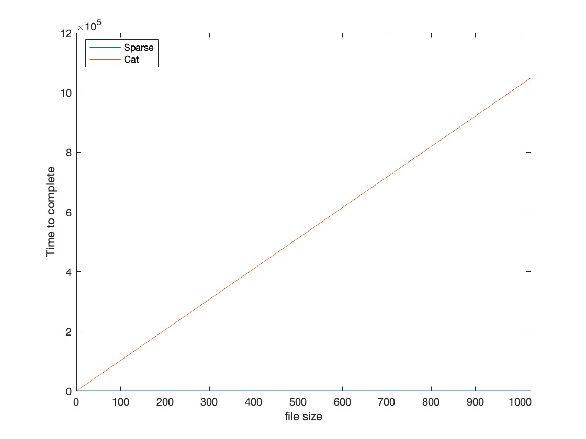

# System Calls

## Assignment 1: *Echo*
The output of the `strace` looks as follows:
```
execve("./Echo", ["./Echo", "Hello", "World"], 0x7ffffff520 /* 24 vars */) = 0
brk(NULL)                               = 0x5555562000
faccessat(AT_FDCWD, "/etc/ld.so.preload", R_OK) = -1 ENOENT (No such file or directory)
openat(AT_FDCWD, "/etc/ld.so.cache", O_RDONLY|O_CLOEXEC) = 3
fstat(3, {st_mode=S_IFREG|0644, st_size=72939, ...}) = 0
mmap(NULL, 72939, PROT_READ, MAP_PRIVATE, 3, 0) = 0x7ff7fba000
close(3)                                = 0
openat(AT_FDCWD, "/lib/aarch64-linux-gnu/libc.so.6", O_RDONLY|O_CLOEXEC) = 3
read(3, "\177ELF\2\1\1\3\0\0\0\0\0\0\0\0\3\0\267\0\1\0\0\0`\17\2\0\0\0\0\0"..., 832) = 832
fstat(3, {st_mode=S_IFREG|0755, st_size=1455120, ...}) = 0
mmap(NULL, 8192, PROT_READ|PROT_WRITE, MAP_PRIVATE|MAP_ANONYMOUS, -1, 0) = 0x7ff7ff8000
mmap(NULL, 1527752, PROT_READ|PROT_EXEC, MAP_PRIVATE|MAP_DENYWRITE, 3, 0) = 0x7ff7e45000
mprotect(0x7ff7fa2000, 61440, PROT_NONE) = 0
mmap(0x7ff7fb1000, 24576, PROT_READ|PROT_WRITE, MAP_PRIVATE|MAP_FIXED|MAP_DENYWRITE, 3, 0x15c000) = 0x7ff7fb1000
mmap(0x7ff7fb7000, 12232, PROT_READ|PROT_WRITE, MAP_PRIVATE|MAP_FIXED|MAP_ANONYMOUS, -1, 0) = 0x7ff7fb7000
close(3)                                = 0
mprotect(0x7ff7fb1000, 16384, PROT_READ) = 0
mprotect(0x5555560000, 4096, PROT_READ) = 0
mprotect(0x7ff7ffd000, 4096, PROT_READ) = 0
munmap(0x7ff7fba000, 72939)             = 0
fstat(1, {st_mode=S_IFCHR|0620, st_rdev=makedev(0x88, 0), ...}) = 0
brk(NULL)                               = 0x5555562000
brk(0x5555583000)                       = 0x5555583000
write(1, "./Echo Hello World (3)\n", 23./Echo Hello World (3)) = 23
exit_group(0)                           = ?
+++ exited with 0 +++
```

Almost all calls are for the program initialization. However, the specific body calls are the following:
```
brk(NULL)                               = 0x5555562000
brk(0x5555583000)                       = 0x5555583000
write(1, "./Echo Hello World (3)\n", 23./Echo Hello World (3)) = 23
```
This call origins from the body and writes the input back to the terminal using the `write()`. This `write()` is a library call back to the included `<stdio.h>` library. Therefore, this system call originates from a library call. In this case, the libary calls seems to map 1:1 to system calls. However, this does not prove that library calls *always* map 1:1 on system calls, as explained [here](https://unix.stackexchange.com/questions/615872/can-a-library-call-invoke-more-than-one-system-call).

# Scheduling

## Assignment 2: *Loop*
The initial `N` value was 750. Running this took about 5 seconds. Therefore, I tried doubling it, but this resulted in a way higher time than aimed at. By slowly decrementing the value, I eventually ended at `N=1350`. This took 0m10.198s.

Based on the `loop.c` source code, N defines the time it takes to complete two loops. The higher N is, the more loop iterations the program needs to complete. Two loops use the variable. Therefore, an increase by 1 on `N` increases the number of iterations rather considerably. Based on this, I assume that `N` defines the number of CPU cycles that need to be completed (every loop iteration).


## Assignment 3: *SchedXY*
Comparing the times, the FIFO processes ran for about 11 seconds. The RobinRound processes ran for about 15 seconds.

Looking at the source code, I noticed that 2000 loop iterations were required before completion of the program. It seems that the FIFO structure completes these faster then the RobinRound process.


## Assignment 4: *Nice*
Running `./Nice >junk&` resulted in 9 processes created that were visible using `htop`. As can be seen from the file, the processes are finished in their given priorities. 

Running `./Nice x >junk&` resulted in the same results that was visible in `htop`. However, as can be seen from the file, the processes were now shuffled a bit instead of executing based on their priorities.


# I/O

## Assignment 5: *wiringpi*
I have upgraded the library using the terminal commands, since this was easier for me. 

The output of the `gpio readall` command printed the properties of all GPIO pins on the raspberry pi. The following pins were described:
| Pin  | Function                               |
| ---- | -------------------------------------- |
| 0v   | Ground                                 |
| 3.3v | An output pin giving 3.3 volts         |
| 5v   | An output pin giving 5 volts           |
| GPIO | Pins used for input/output             |
| TxD  | UART transmit                          |
| RxD  | UART receive                           |
| SDA  | serial data, used in the I2C protocol  |
| SDC  | serial clock, used in the I2C protocol |
| MOSI | SPI protocol, master out - slave in    |
| Miso | SPI protocol, master in - slave out    |

## Assignment 6: *GPIO*
I created the following code:
``` bash
#!/bin/bash

gpio mode 0 output;

for i in {1..5}
do
  echo "I work";
  gpio toggle 0;
  sleep 1;
done
```
The pin number is 0 since this is the wiring ping according to the documentation. It blinks 5 times with a 1 second interval.

**INSERT IMAGE**

## Assignment 7: *Light dependent resistor*


## Assignment 8: *Blink*
Looking at the system calls, the program calls the kernel in the following way: `clock_nanosleep(CLOCK_REALTIME, 0, {tv_sec=0, tv_nsec=500000000}, 0x7ffffff380) = 0` when it is time to blink the LED. the `CLOCK_REALTIME` flag causes me to believe that the seconds are based on the real system time, and not the internal time of the CPU (such as wait a 1000 clock cycles). Therefore, when the system is clogged, it will not delay the blinking of the LED.


## Assignment 9: *Sparse*
I made the following graph:


As can be seen, the sparse maintained a constant time, whereas cat increased linearly with the size.

Some further investigation lead me to believe that sparse files do not write null contents to the disk and write this in the metadata. Cat does write these to the disk. This ensures that sparse is writing only the necessities and is therefore much faster.


## Assignment 10: *Fadvise*
| Time         | Foo   | Foo1   | Bar x  | Bar 1  |
| ------------ | ----- | ------ | ------ | ------ |
| Real         | 3,061 | 20,297 | 46,927 | 28,924 |
| User         | 1,264 | 0,000  | 1,207  | 0,004  |
| Sys          | 1,793 | 2,155  | 3,316  | 2,605  |
| Cached disks | 3434  | 3457   | 2854   | 2836   |

As can be seen, the time for `Foo` is relatively high compared to the others. Upon further investigation, I found that `Bar x` advises the program to release the blocks using the `posix_fadvise(out, 0,0,POSIX_FADV_DONTNEED)` command.

## Assignment 11: *ln.sh*
The output is the following:
```
655326 -rw-r--r-- 2 AaronPi AaronPi 12 Oct 30 13:08 a
655326 -rw-r--r-- 2 AaronPi AaronPi 12 Oct 30 13:08 b
Hello World

655327 lrwxrwxrwx 1 AaronPi AaronPi 1 Oct 30 13:08 c -> a

655326 -rw-r--r-- 1 AaronPi AaronPi 12 Oct 30 13:08 a
655327 lrwxrwxrwx 1 AaronPi AaronPi  1 Oct 30 13:08 c -> a
Hello World
```
In the first two rules of the outut, file `a` is created and `b` is linked to it. File `a` is then deleted. Calling `b` then results in the output of file `a` because of the hard link to the original data.   

The second part creates a symbolic link from `c` to `a`. However, since `a` does not exist anymore, `c` has no contents and nothing is printed. 

The final part creates `a` again (with "hello world" as content), so when `c` is called, there is an output since the symbolic link is working again.


## Assignment 12: *Pipe.c*
A few of my outputs were the following
```
Output 1 --------------------------------------
parent 1918658857
child  1918658857

Output 2 --------------------------------------
parent 249395926
child  249395926

Output 3 --------------------------------------
parent 249395926
child  249395926
```

The program does a number of things. Firstly, it creates a pipe between a parent and a child process (created using a `fork()`). This pipe is then closed, and a random number is transferred trough the pipe. This is why the output is different every time.

The close calls are both generated by the parent and by the child. Both create a `close` call for the reading and the writing, resulting in a total of 4 `close` calls.


## Assignment 13: *Fifo.c*
The files seem to do the same procedure: both send a random number between parent and child trough a pipe.

However, the Fifo uses a named pipe, whereas `Pipe.c` uses an unnamed pipe. In this way, we call the program using the pipe instead of creating a pipe within the program itself.

A named pipe is shown using `ls -l` by the additional `p` flag as can be seen here:` prw-r--r-- 1 AaronPi AaronPi     0 Oct 30 13:17 fifo`
## Assignment 14: *Readdir.c*
I edited the program in the following way:
``` C
/*  Readdir.c - Read the current working directory */
#include <dirent.h>
#include <errno.h>
#include <stdio.h>
#include <string.h>
#include <sys/stat.h>
#include <fcntl.h>
#include <sys/types.h>

int main(int argc, char * argv[]) {
    if(argc>=2) {
        DIR *dirp = opendir(argv[1]) ;
        if ( dirp != NULL ) {
            struct dirent *dp ;
            struct stat buffer;
            while ((dp = readdir(dirp))) {
                char t;
                switch( dp->d_type ) {
                    case DT_BLK     : t = 'b' ; break ;
                    case DT_CHR     : t = 'c' ; break ;
                    case DT_DIR     : t = 'd' ; break ;
                    case DT_FIFO    : t = 'p' ; break ;
                    case DT_LNK     : t = 'l' ; break ;
                    case DT_REG     : t = '-' ;
                        struct stat buffer;
                        int temp = stat(strcat(argv[1], dp->d_name), &buffer);
                        printf(" size: %d\n", buffer.st_size);
                        break ;
                    case DT_SOCK    : t = 's' ; break ;
                    case DT_UNKNOWN : t = 'u' ; break ;
                    default         : t = '?' ;
                }
                printf("%8d %c %s %d\n", (int)dp->d_ino, t, dp->d_name);
            }
            closedir(dirp);
        }
        return 0;
    } else {
        printf("usage: %s dir\n", argv[0]);
        return 1;
    }
}

/*  Please note that the checks on the return value of the system calls
    have been omitted to avoid cluttering the code. However, system calls
```

In case the read item is a file, a buffer is created. In a temporary value, the size of the file is written to the buffer variable mentioned earlier. This can then be read from the print statement and printer out to the terminal.


## Assignment 15: *fdisk*
The difference in output is the following:
```
Disk /dev/sda: 960 MiB, 1006632960 bytes, 1966080 sectors
Disk model: UDisk           
Units: sectors of 1 * 512 = 512 bytes
Sector size (logical/physical): 512 bytes / 512 bytes
I/O size (minimum/optimal): 512 bytes / 512 bytes
Disklabel type: dos
Disk identifier: 0x6f20736b

Device     Boot      Start        End    Sectors   Size Id Type
/dev/sda1        778135908 1919645538 1141509631 544.3G 72 unknown
/dev/sda2        168689522 2104717761 1936028240 923.2G 65 Novell Netware 386
/dev/sda3       1869881465 3805909656 1936028192 923.2G 79 unknown
/dev/sda4                0 3637226495 3637226496   1.7T  d unknown

Partition table entries are not in disk order.
```

From this, we see that the contents can be found at `/dev/sda`


## Assignment 16: *Filesystems on the pi*
The following filesystems are mounted:
```
Filesystem     1K-blocks    Used Available Use% Mounted on
/dev/root       29406740 6900884  21253820  25% /
devtmpfs         1776952       0   1776952   0% /dev
tmpfs            1942712       0   1942712   0% /dev/shm
tmpfs             777088    2004    775084   1% /run
tmpfs               5120       4      5116   1% /run/lock
/dev/mmcblk0p1    261108   32840    228268  13% /boot
tmpfs             388540      20    388520   1% /run/user/1000
/dev/sda          982768      48    982720   1% /media/AaronPi/8A64-AEA3
```

The file systems have the following function:
| FileSystem       | Function                                                 |
| ---------------- | -------------------------------------------------------- |
| `/dev/root`      | Link tot he current system                               |
| `devtmpfs`       | Locations of devices and special files                   |
| `tmpfs`          | General files used for caching. This is general purpose. |
| `/dev/mmcblk0p1` | The SD card that runs the operating system               |
| `/dev/sda`       | The USB stick                                            |

`/sys` is the place where hardware information and drivers are stored. This was stored `/proc` but has been moved.

## Assignment 18: *Mount.c*
The `ls -l /mnt/usb` command shows that 16 files are present on the USB stick. It does not show which files.

`./Mount $HOME` has the following output:
```
//home/AaronPi not mounted
//home not mounted
/ mounted on /dev/root
```

```
//mnt/usb mounted on /dev/sda
//mnt not mounted
/ mounted on /dev/root
```

Both outputs are mounted at the location for the current system, as can be expected. Then, the parent directory of the 'mounted' is checked, and is not mounted. Then, the first rule states the target directory and if it is mounted or not. Only the USB drive is mounted as can be seen from the output.

## Assignment 18: *Unplug*
Before an USB device is unplugged, we need to ensure that no programs are reading or writing from/to the usb stick. This would corrupt the data or halt a program unexpectedly.

To do this, we first need to unmount the usb stick and then eject it. This is done in the following way:
``` bash
sudo umount /dev/sda
sudo eject /dev/sda
```


## Assignment 19: *Fadvise*
I mounted the usb stick using: `sudo mount -t vfat /dev/sda /mnt/usb`.

The following times were measures:
| Time | SD    | USB    |
| ---- | ----- | ------ |
| Real | 1,327 | 39,896 |
| User | 1,323 | 01,274 |
| Sys  | 0,004 | 01,333 |

As can be seen, the SD card is much faster than the USB stick. I believe this is because the SD card has more connectors and direct connectors, whereas the USB stick is also reliant on the speed of the USB ports on the pi, and the communication protocols between the processor and the USB ports.

## Assignment 20: *Ext4*
The following times were recorded
| Time | USB (first) | USB (second) |
| ---- | ----------- | ------------ |
| Real | 6,090       | 0,158        |
| User | 0,009       | 0,022        |
| Sys  | 0,232       | 0,137        |

The second time the command is ran, the speeds are much quicker.
## Assignment 21: *Ext4 read and write*
The usb stick was formatted so no data was present on it. Only the command was executed. This can also be seen from the output:
```
AaronPi@blueberry:~/AssignmentFiles $ ls -l /mnt/usb
total 102416
-rw-r--r-- 1 root root 104857600 Oct 30 15:41 100m-rnd.raw
```

No other files were written.

## Assignment 22: *Backup ext4*
The command did run. However, this is not a good idea. Since the system is running, chances might occur during the backup. This might impact you when you try to run the backup during a later stage.


## Assignment 23: *Unsafe removal*
Upon re-mounting the ubs stick, a number of errors occurred on the screen. The following is an example of such an error:
```
Message from syslogd@blueberry at Oct 30 15:50:10 ...
 kernel:[13150.216340] EXT4-fs (sda): failed to convert unwritten extents to written extents -- potential data loss!  (inode 13, error -30)
```

Running `ls -l /mnt/usb` to see what files were present on the usb stick resulted in an error as can be seen. The only choice I had was to reformat the usb drive recreate the file.

```
AaronPi@blueberry:~/AssignmentFiles $ ls -l /mnt/usb
ls: reading directory '/mnt/usb': Input/output error
total 0
```


After compiling the file and running it, it printed the following:
```
Read 104857600 bytes from the file!
```

This is about 10% of the total file size. Since I removed the USB stick after about 1 second, this makes sense since only 10% of the time, the stick was being read.
## Assignment 24: *tail -f*
`tail -f` follows a file and prints the changed contents to the terminal. For example, if you add "hello world" to the end of a file, whilst the `tail -f <yourFile>` is running, the terminal will print 'hello world'.

Running `tail -f /var/log/daemon.log /var/log/syslog` gives the following output:
```
==> /var/log/daemon.log <==
Oct 30 16:11:07 blueberry rngd[534]: stats: FIPS 140-2(2001-10-10) Poker: 0
Oct 30 16:11:07 blueberry rngd[534]: stats: FIPS 140-2(2001-10-10) Runs: 0
Oct 30 16:11:07 blueberry rngd[534]: stats: FIPS 140-2(2001-10-10) Long run: 0
Oct 30 16:11:07 blueberry rngd[534]: stats: FIPS 140-2(2001-10-10) Continuous run: 0
Oct 30 16:11:07 blueberry rngd[534]: stats: HRNG source speed: (min=226.483; avg=466.684; max=666.573)Kibits/s
Oct 30 16:11:07 blueberry rngd[534]: stats: FIPS tests speed: (min=23.204; avg=30.591; max=77.851)Mibits/s
Oct 30 16:11:07 blueberry rngd[534]: stats: Lowest ready-buffers level: 2
Oct 30 16:11:07 blueberry rngd[534]: stats: Entropy starvations: 0
Oct 30 16:11:07 blueberry rngd[534]: stats: Time spent starving for entropy: (min=0; avg=0.000; max=0)us
Oct 30 16:12:45 blueberry systemd[1]: Started Session 12 of user AaronPi.

==> /var/log/syslog <==
Oct 30 16:11:07 blueberry rngd[534]: stats: FIPS 140-2(2001-10-10) Poker: 0
Oct 30 16:11:07 blueberry rngd[534]: stats: FIPS 140-2(2001-10-10) Runs: 0
Oct 30 16:11:07 blueberry rngd[534]: stats: FIPS 140-2(2001-10-10) Long run: 0
Oct 30 16:11:07 blueberry rngd[534]: stats: FIPS 140-2(2001-10-10) Continuous run: 0
Oct 30 16:11:07 blueberry rngd[534]: stats: HRNG source speed: (min=226.483; avg=466.684; max=666.573)Kibits/s
Oct 30 16:11:07 blueberry rngd[534]: stats: FIPS tests speed: (min=23.204; avg=30.591; max=77.851)Mibits/s
Oct 30 16:11:07 blueberry rngd[534]: stats: Lowest ready-buffers level: 2
Oct 30 16:11:07 blueberry rngd[534]: stats: Entropy starvations: 0
Oct 30 16:11:07 blueberry rngd[534]: stats: Time spent starving for entropy: (min=0; avg=0.000; max=0)us
Oct 30 16:12:45 blueberry systemd[1]: Started Session 12 of user AaronPi.
```
Two sessions are started to watch these files. Running this under `strace` showed me that an an `inotify` event was initiated. This event is triggered when a file is changed. The call adds a watch `inotify_add_watch` to observe these changes, and report them to the terminal. For multiple files, the system is just observing both the files"
```
inotify_add_watch(5, "/var/log/daemon.log", IN_MODIFY) = 1
inotify_add_watch(5, "/var/log/syslog", IN_MODIFY) = 2
```
# Kernel

## Assignment 25: *lsmod*
Active modules are stored at: `/proc/modules`. The command `lsmod` nicely prints these to the terminal.