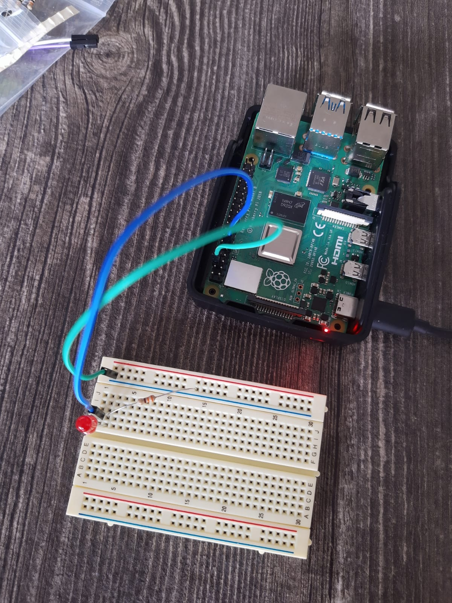
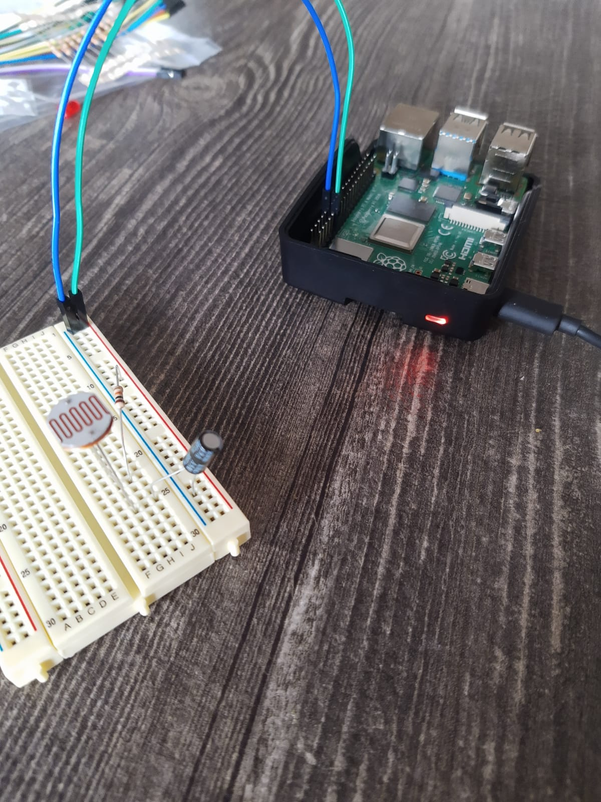

# System Calls

## Assignment 1: *Echo*

The output is as follows:

```
pi@pi-logmans:~/week2/files $ strace ./Echo Hello World
execve("./Echo", ["./Echo", "Hello", "World"], 0x7fcb909350 /* 32 vars */) = 0
brk(NULL)                               = 0x557365d000
faccessat(AT_FDCWD, "/etc/ld.so.preload", R_OK) = -1 ENOENT (No such file or directory)
openat(AT_FDCWD, "/etc/ld.so.cache", O_RDONLY|O_CLOEXEC) = 3
fstat(3, {st_mode=S_IFREG|0644, st_size=72939, ...}) = 0
mmap(NULL, 72939, PROT_READ, MAP_PRIVATE, 3, 0) = 0x7faafb1000
close(3)                                = 0
openat(AT_FDCWD, "/lib/aarch64-linux-gnu/libc.so.6", O_RDONLY|O_CLOEXEC) = 3
read(3, "\177ELF\2\1\1\3\0\0\0\0\0\0\0\0\3\0\267\0\1\0\0\0`\17\2\0\0\0\0\0"..., 832) = 832
fstat(3, {st_mode=S_IFREG|0755, st_size=1455120, ...}) = 0
mmap(NULL, 8192, PROT_READ|PROT_WRITE, MAP_PRIVATE|MAP_ANONYMOUS, -1, 0) = 0x7faafef000
mmap(NULL, 1527752, PROT_READ|PROT_EXEC, MAP_PRIVATE|MAP_DENYWRITE, 3, 0) = 0x7faae3c000
mprotect(0x7faaf99000, 61440, PROT_NONE) = 0
mmap(0x7faafa8000, 24576, PROT_READ|PROT_WRITE, MAP_PRIVATE|MAP_FIXED|MAP_DENYWRITE, 3, 0x15c000) = 0x7faafa8000
mmap(0x7faafae000, 12232, PROT_READ|PROT_WRITE, MAP_PRIVATE|MAP_FIXED|MAP_ANONYMOUS, -1, 0) = 0x7faafae000
close(3)                                = 0
mprotect(0x7faafa8000, 16384, PROT_READ) = 0
mprotect(0x55587e0000, 4096, PROT_READ) = 0
mprotect(0x7faaff4000, 4096, PROT_READ) = 0
munmap(0x7faafb1000, 72939)             = 0
fstat(1, {st_mode=S_IFCHR|0620, st_rdev=makedev(0x88, 0), ...}) = 0
brk(NULL)                               = 0x557365d000
brk(0x557367e000)                       = 0x557367e000
write(1, "./Echo Hello World (3)\n", 23./Echo Hello World (3)
) = 23
exit_group(0)                           = ?
+++ exited with 0 +++
```

Where only the following calls are specific to the program:

```
brk(NULL)                               = 0x557365d000
brk(0x557367e000)                       = 0x557367e000
write(1, "./Echo Hello World (3)\n", 23./Echo Hello World (3)
) = 23
```

All other commands are for the program initialization.

There is one function from a library: `printf()` from `stdio.h`. This is translated to a syscall `write()` from the `util-linux` package. From this it can be deducted that library calls are compiled to system calls, but system calls can also be in system libraries.

# Scheduling

## Assignment 2: *Loop*

By changing `N` to `1400` it takes 10.9 seconds to execute on my Pi.

## Assignment 3: *SchedXY*

As I could not observe any difference in scheduling I started a lot more processes: `sudo ./RR80& sudo ./RR80& sudo ./RR80& sudo ./RR80& sudo ./FIFO80& sudo ./FIFO80&`. From this it could be observed that the FIFO processes finished earlier than the Round-Robin processes, even though they were started later. While the observation was quite hard because `htop` had trouble transmitting over SSH with this load, I believe that the Round-Robin processes yielded to the FIFO processes and these then hogged the CPU until they were done.

## Assignment 4: *Nice*

`Nice.c` creates a lot of processes and assigns them different priorities. From `htop` and the output file it can be seen that the processes finish in their order of priority. However, all processes are executed on the same processor. With the extra argument it shuffles the priorities around.

# I/O

## Assignment 5: *wiringpi*

```
+-----+-----+---------+------+---+---Pi 4B--+---+------+---------+-----+-----+
 | BCM | wPi |   Name  | Mode | V | Physical | V | Mode | Name    | wPi | BCM |
 +-----+-----+---------+------+---+----++----+---+------+---------+-----+-----+
 |     |     |    3.3v |      |   |  1 || 2  |   |      | 5v      |     |     |
 |   2 |   8 |   SDA.1 |   IN | 1 |  3 || 4  |   |      | 5v      |     |     |
 |   3 |   9 |   SCL.1 |   IN | 1 |  5 || 6  |   |      | 0v      |     |     |
 |   4 |   7 | GPIO. 7 |   IN | 1 |  7 || 8  | 1 | IN   | TxD     | 15  | 14  |
 |     |     |      0v |      |   |  9 || 10 | 1 | IN   | RxD     | 16  | 15  |
 |  17 |   0 | GPIO. 0 |   IN | 0 | 11 || 12 | 0 | IN   | GPIO. 1 | 1   | 18  |
 |  27 |   2 | GPIO. 2 |   IN | 0 | 13 || 14 |   |      | 0v      |     |     |
 |  22 |   3 | GPIO. 3 |   IN | 0 | 15 || 16 | 0 | IN   | GPIO. 4 | 4   | 23  |
 |     |     |    3.3v |      |   | 17 || 18 | 0 | IN   | GPIO. 5 | 5   | 24  |
 |  10 |  12 |    MOSI |   IN | 0 | 19 || 20 |   |      | 0v      |     |     |
 |   9 |  13 |    MISO |   IN | 0 | 21 || 22 | 0 | IN   | GPIO. 6 | 6   | 25  |
 |  11 |  14 |    SCLK |   IN | 0 | 23 || 24 | 1 | IN   | CE0     | 10  | 8   |
 |     |     |      0v |      |   | 25 || 26 | 1 | IN   | CE1     | 11  | 7   |
 |   0 |  30 |   SDA.0 |   IN | 1 | 27 || 28 | 1 | IN   | SCL.0   | 31  | 1   |
 |   5 |  21 | GPIO.21 |   IN | 1 | 29 || 30 |   |      | 0v      |     |     |
 |   6 |  22 | GPIO.22 |   IN | 1 | 31 || 32 | 0 | IN   | GPIO.26 | 26  | 12  |
 |  13 |  23 | GPIO.23 |   IN | 0 | 33 || 34 |   |      | 0v      |     |     |
 |  19 |  24 | GPIO.24 |   IN | 0 | 35 || 36 | 0 | IN   | GPIO.27 | 27  | 16  |
 |  26 |  25 | GPIO.25 |   IN | 0 | 37 || 38 | 0 | IN   | GPIO.28 | 28  | 20  |
 |     |     |      0v |      |   | 39 || 40 | 0 | IN   | GPIO.29 | 29  | 21  |
 +-----+-----+---------+------+---+----++----+---+------+---------+-----+-----+
 | BCM | wPi |   Name  | Mode | V | Physical | V | Mode | Name    | wPi | BCM |
 +-----+-----+---------+------+---+---Pi 4B--+---+------+---------+-----+-----+
 ```

 This describes the properties of all the GPIO pins on the RPi. A small explanation of all the types of pins:

 ```
0v: ground
3.3v: 3.3V output
5v: 5V output
SDA: Serial Data (I2C)
SDC: Serial Clock (I2C)
TxD: UART transmit
RxD: UART receive
MOSI: Master Out, Slave In (SPI)
MISO: Master In, Slave Out (SPI)
SCLK: SPI clock
GPIO: General Purpose I/O pins
 ```

## Assignment 6: *GPIO*

I wrote the following script:

```bash
#!/bin/bash

gpio mode 0 output;
while [ true ]
do
  gpio toggle 0;
  sleep $1;
done
```

Where the sleep time can be passed as an argument (e.g. `bash blink.sh 2m` for toggling every two minutes).



## Assignment 7: *Light dependent resistor*

I wrote the following script:

```bash
#!/bin/bash

gpio mode 0 output;
gpio mode 1 input;

gpio write 0 1;

time=0;

read=$(gpio read 1);
until [ $read -gt 0 ]
do
  sleep 0.1;
  read=$(gpio read 1);
  ((time++));
done

gpio write 0 0;

echo Ticks: $time;

echo "Capacitor had output!"
```

And made the following circuit:



However, upon execution it would consistently exit immediately saying it had received a charge. But when removing the capacitor and shorting the circuit at a certain moment by hand it would measure it perfectly fine. Are any components broken? I can't tell because I don't have a multimeter here...

## Assignment 8: *Blink*

When implementing `sched_getscheduler(0)` it returns `null`. I cannot find which scheduler class this program uses. However, based on the system load the program may indeed start to slightly mess up the timings. This mainly happens when the actual commands (not the delays) are slightly postponed by the CPU.

## Assignment 9: *Sparse*

The following graph was made:


`Sparse` has a constant time to output, while `cat` scales linearly with the size of the file.

Sparse files do not write the null contents to the disk and merely write this in the metadata. This siginificantly speeds up the write speed as barely anything needs to be written.

## Assignment 10: *Fadvise*

| Time (s) |     | a/out Foo | Foo Foo1 | a.out Bar x | Bar Bar1 |
|----------|-----|-----------|----------|-------------|----------|
| real     |     | 3.076     | 20.958   | 53.022      | 37.822   |
| user     |     | 1.257     | 0.008    | 1.341       | 0.004    |
| sys      |     | 1.801     | 2.000    | 2.788       | 2.887    |
| cached   | 684 | 1198      | 1712     | 1713        | 2728     |

As can be seen, the number of cached blocks goes up rapidly after every copy, except after `./a.out Bar x` where the number of cached blocks is practically equivalent. This is because the `x` makes `a.out` advise the kernel to release the cached blocks with `posix_fadvise(out, 0,0,POSIX_FADV_DONTNEED)`.

## Assignment 11: *ln.sh*

First file `a` is created. Then a link to `a` is created with the name `b`. This is the output of the `ls` command:

```
525310 -rw-r--r-- 2 pi pi 12 Oct 22 15:07 a
525310 -rw-r--r-- 2 pi pi 12 Oct 22 15:07 b
```

Then `a` is removed. `cat b` is called, which still outputs `Hello World` as a hard link still points to the original data which is still saved. `b` is linked to  `a` and `ls` is called again. `c` is symbollically linked to `a` and then printed. Then both `a` and `b` are removed.

```
525313 lrwxrwxrwx 1 pi pi 1 Oct 22 15:07 c -> a
```

Then `c` is printed which fails as there is no `a` anymore (symbolic link is not linked to the underlying inode). Then "Hello World" is put into `a` again and now both `a` and `c` exist again:

```
525310 -rw-r--r-- 1 pi pi 12 Oct 22 15:07 a
525313 lrwxrwxrwx 1 pi pi  1 Oct 22 15:07 c -> a
```

And `c` can be printed again.


## Assignment 12: *Pipe.c*


## Assignment 13: *Fifo.c*


## Assignment 14: *Readdir.c*


## Assignment 15: *fdisk*


## Assignment 16: *Filesystems on the pi*


## Assignment 18: *Mount.c*


## Assignment 18: *Unplug*


## Assignment 19: *Fadvise*


## Assignment 20: *Ext4*


## Assignment 21: *Ext4 read and write*


## Assignment 22: *Backup ext4*


## Assignment 23: *Unsafe removal*


## Assignment 24: *tail -f*


# Kernel

## Assignment 25: *lsmod*


## Sparse logs
```
pi@pi-logmans:~/week2/files $ bash -x sparse.sh > sparse.log
+ /bin/rm -rf sparse.dir
+ mkdir sparse.dir
+ cd sparse.dir
+ gcc ../Sparse.c
+ for d in . /tmp
+ for i in 1 2 4 8 16 32 64 128 256 512 1024
+ echo 'Now in pass 1 in .'
+ /bin/rm -rf ./1.dat
+ ./a.out ./1.dat 1

real	0m0.002s
user	0m0.002s
sys	0m0.000s
+ cat ./1.dat

real	0m0.008s
user	0m0.000s
sys	0m0.008s
+ ls -l ./1.dat ./junk
+ du ./1.dat ./junk
+ /bin/rm -rf ./1.dat
+ for i in 1 2 4 8 16 32 64 128 256 512 1024
+ echo 'Now in pass 2 in .'
+ /bin/rm -rf ./2.dat
+ ./a.out ./2.dat 2

real	0m0.002s
user	0m0.000s
sys	0m0.002s
+ cat ./2.dat

real	0m0.016s
user	0m0.000s
sys	0m0.015s
+ ls -l ./2.dat ./junk
+ du ./2.dat ./junk
+ /bin/rm -rf ./2.dat
+ for i in 1 2 4 8 16 32 64 128 256 512 1024
+ echo 'Now in pass 4 in .'
+ /bin/rm -rf ./4.dat
+ ./a.out ./4.dat 4

real	0m0.002s
user	0m0.000s
sys	0m0.002s
+ cat ./4.dat

real	0m0.073s
user	0m0.000s
sys	0m0.028s
+ ls -l ./4.dat ./junk
+ du ./4.dat ./junk
+ /bin/rm -rf ./4.dat
+ for i in 1 2 4 8 16 32 64 128 256 512 1024
+ echo 'Now in pass 8 in .'
+ /bin/rm -rf ./8.dat
+ ./a.out ./8.dat 8

real	0m0.002s
user	0m0.001s
sys	0m0.001s
+ cat ./8.dat

real	0m0.136s
user	0m0.000s
sys	0m0.052s
+ ls -l ./8.dat ./junk
+ du ./8.dat ./junk
+ /bin/rm -rf ./8.dat
+ for i in 1 2 4 8 16 32 64 128 256 512 1024
+ echo 'Now in pass 16 in .'
+ /bin/rm -rf ./16.dat
+ ./a.out ./16.dat 16

real	0m0.002s
user	0m0.000s
sys	0m0.002s
+ cat ./16.dat

real	0m0.283s
user	0m0.000s
sys	0m0.100s
+ ls -l ./16.dat ./junk
+ du ./16.dat ./junk
+ /bin/rm -rf ./16.dat
+ for i in 1 2 4 8 16 32 64 128 256 512 1024
+ echo 'Now in pass 32 in .'
+ /bin/rm -rf ./32.dat
+ ./a.out ./32.dat 32

real	0m0.002s
user	0m0.002s
sys	0m0.000s
+ cat ./32.dat

real	0m0.575s
user	0m0.001s
sys	0m0.192s
+ ls -l ./32.dat ./junk
+ du ./32.dat ./junk
+ /bin/rm -rf ./32.dat
+ for i in 1 2 4 8 16 32 64 128 256 512 1024
+ echo 'Now in pass 64 in .'
+ /bin/rm -rf ./64.dat
+ ./a.out ./64.dat 64

real	0m0.002s
user	0m0.001s
sys	0m0.000s
+ cat ./64.dat

real	0m2.720s
user	0m0.004s
sys	0m0.376s
+ ls -l ./64.dat ./junk
+ du ./64.dat ./junk
+ /bin/rm -rf ./64.dat
+ for i in 1 2 4 8 16 32 64 128 256 512 1024
+ echo 'Now in pass 128 in .'
+ /bin/rm -rf ./128.dat
+ ./a.out ./128.dat 128

real	0m0.002s
user	0m0.001s
sys	0m0.000s
+ cat ./128.dat

real	0m9.105s
user	0m0.000s
sys	0m0.850s
+ ls -l ./128.dat ./junk
+ du ./128.dat ./junk
+ /bin/rm -rf ./128.dat
+ for i in 1 2 4 8 16 32 64 128 256 512 1024
+ echo 'Now in pass 256 in .'
+ /bin/rm -rf ./256.dat
+ ./a.out ./256.dat 256

real	0m0.002s
user	0m0.001s
sys	0m0.001s
+ cat ./256.dat

real	0m16.209s
user	0m0.013s
sys	0m1.634s
+ ls -l ./256.dat ./junk
+ du ./256.dat ./junk
+ /bin/rm -rf ./256.dat
+ for i in 1 2 4 8 16 32 64 128 256 512 1024
+ echo 'Now in pass 512 in .'
+ /bin/rm -rf ./512.dat
+ ./a.out ./512.dat 512

real	0m0.002s
user	0m0.002s
sys	0m0.000s
+ cat ./512.dat

real	0m26.545s
user	0m0.004s
sys	0m2.988s
+ ls -l ./512.dat ./junk
+ du ./512.dat ./junk
+ /bin/rm -rf ./512.dat
+ for i in 1 2 4 8 16 32 64 128 256 512 1024
+ echo 'Now in pass 1024 in .'
+ /bin/rm -rf ./1024.dat
+ ./a.out ./1024.dat 1024

real	0m0.002s
user	0m0.001s
sys	0m0.001s
+ cat ./1024.dat

real	0m56.028s
user	0m0.006s
sys	0m5.879s
+ ls -l ./1024.dat ./junk
+ du ./1024.dat ./junk
+ /bin/rm -rf ./1024.dat
+ for d in . /tmp
+ for i in 1 2 4 8 16 32 64 128 256 512 1024
+ echo 'Now in pass 1 in /tmp'
+ /bin/rm -rf /tmp/1.dat
+ ./a.out /tmp/1.dat 1

real	0m0.002s
user	0m0.001s
sys	0m0.001s
+ cat /tmp/1.dat

real	0m0.009s
user	0m0.000s
sys	0m0.008s
+ ls -l /tmp/1.dat /tmp/junk
+ du /tmp/1.dat /tmp/junk
+ /bin/rm -rf /tmp/1.dat
+ for i in 1 2 4 8 16 32 64 128 256 512 1024
+ echo 'Now in pass 2 in /tmp'
+ /bin/rm -rf /tmp/2.dat
+ ./a.out /tmp/2.dat 2

real	0m0.002s
user	0m0.001s
sys	0m0.001s
+ cat /tmp/2.dat

real	0m0.016s
user	0m0.000s
sys	0m0.017s
+ ls -l /tmp/2.dat /tmp/junk
+ du /tmp/2.dat /tmp/junk
+ /bin/rm -rf /tmp/2.dat
+ for i in 1 2 4 8 16 32 64 128 256 512 1024
+ echo 'Now in pass 4 in /tmp'
+ /bin/rm -rf /tmp/4.dat
+ ./a.out /tmp/4.dat 4

real	0m0.002s
user	0m0.000s
sys	0m0.002s
+ cat /tmp/4.dat

real	0m3.011s
user	0m0.000s
sys	0m0.031s
+ ls -l /tmp/4.dat /tmp/junk
+ du /tmp/4.dat /tmp/junk
+ /bin/rm -rf /tmp/4.dat
+ for i in 1 2 4 8 16 32 64 128 256 512 1024
+ echo 'Now in pass 8 in /tmp'
+ /bin/rm -rf /tmp/8.dat
+ ./a.out /tmp/8.dat 8

real	0m0.002s
user	0m0.000s
sys	0m0.002s
+ cat /tmp/8.dat

real	0m0.146s
user	0m0.000s
sys	0m0.060s
+ ls -l /tmp/8.dat /tmp/junk
+ du /tmp/8.dat /tmp/junk
+ /bin/rm -rf /tmp/8.dat
+ for i in 1 2 4 8 16 32 64 128 256 512 1024
+ echo 'Now in pass 16 in /tmp'
+ /bin/rm -rf /tmp/16.dat
+ ./a.out /tmp/16.dat 16

real	0m0.002s
user	0m0.001s
sys	0m0.001s
+ cat /tmp/16.dat

real	0m0.364s
user	0m0.000s
sys	0m0.111s
+ ls -l /tmp/16.dat /tmp/junk
+ du /tmp/16.dat /tmp/junk
+ /bin/rm -rf /tmp/16.dat
+ for i in 1 2 4 8 16 32 64 128 256 512 1024
+ echo 'Now in pass 32 in /tmp'
+ /bin/rm -rf /tmp/32.dat
+ ./a.out /tmp/32.dat 32

real	0m0.002s
user	0m0.001s
sys	0m0.001s
+ cat /tmp/32.dat

real	0m1.582s
user	0m0.004s
sys	0m0.239s
+ ls -l /tmp/32.dat /tmp/junk
+ du /tmp/32.dat /tmp/junk
+ /bin/rm -rf /tmp/32.dat
+ for i in 1 2 4 8 16 32 64 128 256 512 1024
+ echo 'Now in pass 64 in /tmp'
+ /bin/rm -rf /tmp/64.dat
+ ./a.out /tmp/64.dat 64

real	0m0.002s
user	0m0.000s
sys	0m0.002s
+ cat /tmp/64.dat

real	0m3.026s
user	0m0.002s
sys	0m0.392s
+ ls -l /tmp/64.dat /tmp/junk
+ du /tmp/64.dat /tmp/junk
+ /bin/rm -rf /tmp/64.dat
+ for i in 1 2 4 8 16 32 64 128 256 512 1024
+ echo 'Now in pass 128 in /tmp'
+ /bin/rm -rf /tmp/128.dat
+ ./a.out /tmp/128.dat 128

real	0m0.002s
user	0m0.001s
sys	0m0.001s
+ cat /tmp/128.dat

real	0m7.779s
user	0m0.000s
sys	0m0.856s
+ ls -l /tmp/128.dat /tmp/junk
+ du /tmp/128.dat /tmp/junk
+ /bin/rm -rf /tmp/128.dat
+ for i in 1 2 4 8 16 32 64 128 256 512 1024
+ echo 'Now in pass 256 in /tmp'
+ /bin/rm -rf /tmp/256.dat
+ ./a.out /tmp/256.dat 256

real	0m0.002s
user	0m0.001s
sys	0m0.001s
+ cat /tmp/256.dat

real	0m14.810s
user	0m0.012s
sys	0m1.628s
+ ls -l /tmp/256.dat /tmp/junk
+ du /tmp/256.dat /tmp/junk
+ /bin/rm -rf /tmp/256.dat
+ for i in 1 2 4 8 16 32 64 128 256 512 1024
+ echo 'Now in pass 512 in /tmp'
+ /bin/rm -rf /tmp/512.dat
+ ./a.out /tmp/512.dat 512

real	0m0.002s
user	0m0.000s
sys	0m0.002s
+ cat /tmp/512.dat

real	0m31.187s
user	0m0.004s
sys	0m2.917s
+ ls -l /tmp/512.dat /tmp/junk
+ du /tmp/512.dat /tmp/junk
+ /bin/rm -rf /tmp/512.dat
+ for i in 1 2 4 8 16 32 64 128 256 512 1024
+ echo 'Now in pass 1024 in /tmp'
+ /bin/rm -rf /tmp/1024.dat
+ ./a.out /tmp/1024.dat 1024

real	0m0.002s
user	0m0.000s
sys	0m0.002s
+ cat /tmp/1024.dat

real	0m55.823s
user	0m0.014s
sys	0m5.847s
+ ls -l /tmp/1024.dat /tmp/junk
+ du /tmp/1024.dat /tmp/junk
+ /bin/rm -rf /tmp/1024.dat
+ cd ..
```

```
pi@pi-logmans:~/week2/files $ cat sparse.log 
Now in pass 1 in .
-rw-r--r-- 1 pi pi 1048576 Oct 21 17:32 ./1.dat
-rw-r--r-- 1 pi pi 1048576 Oct 21 17:32 ./junk
4	./1.dat
1024	./junk
Now in pass 2 in .
-rw-r--r-- 1 pi pi 2097152 Oct 21 17:32 ./2.dat
-rw-r--r-- 1 pi pi 2097152 Oct 21 17:32 ./junk
4	./2.dat
2048	./junk
Now in pass 4 in .
-rw-r--r-- 1 pi pi 4194304 Oct 21 17:32 ./4.dat
-rw-r--r-- 1 pi pi 4194304 Oct 21 17:32 ./junk
4	./4.dat
4096	./junk
Now in pass 8 in .
-rw-r--r-- 1 pi pi 8388608 Oct 21 17:32 ./8.dat
-rw-r--r-- 1 pi pi 8388608 Oct 21 17:32 ./junk
4	./8.dat
8192	./junk
Now in pass 16 in .
-rw-r--r-- 1 pi pi 16777216 Oct 21 17:32 ./16.dat
-rw-r--r-- 1 pi pi 16777216 Oct 21 17:32 ./junk
4	./16.dat
16384	./junk
Now in pass 32 in .
-rw-r--r-- 1 pi pi 33554432 Oct 21 17:32 ./32.dat
-rw-r--r-- 1 pi pi 33554432 Oct 21 17:32 ./junk
4	./32.dat
32768	./junk
Now in pass 64 in .
-rw-r--r-- 1 pi pi 67108864 Oct 21 17:32 ./64.dat
-rw-r--r-- 1 pi pi 67108864 Oct 21 17:32 ./junk
4	./64.dat
65540	./junk
Now in pass 128 in .
-rw-r--r-- 1 pi pi 134217728 Oct 21 17:32 ./128.dat
-rw-r--r-- 1 pi pi 134217728 Oct 21 17:32 ./junk
4	./128.dat
131076	./junk
Now in pass 256 in .
-rw-r--r-- 1 pi pi 268435456 Oct 21 17:32 ./256.dat
-rw-r--r-- 1 pi pi 268435456 Oct 21 17:32 ./junk
4	./256.dat
262148	./junk
Now in pass 512 in .
-rw-r--r-- 1 pi pi 536870912 Oct 21 17:32 ./512.dat
-rw-r--r-- 1 pi pi 536870912 Oct 21 17:32 ./junk
4	./512.dat
524292	./junk
Now in pass 1024 in .
-rw-r--r-- 1 pi pi 1073741824 Oct 21 17:33 ./1024.dat
-rw-r--r-- 1 pi pi 1073741824 Oct 21 17:33 ./junk
4	./1024.dat
1048580	./junk
Now in pass 1 in /tmp
-rw-r--r-- 1 pi pi 1048576 Oct 21 17:34 /tmp/1.dat
-rw-r--r-- 1 pi pi 1048576 Oct 21 17:34 /tmp/junk
4	/tmp/1.dat
1024	/tmp/junk
Now in pass 2 in /tmp
-rw-r--r-- 1 pi pi 2097152 Oct 21 17:34 /tmp/2.dat
-rw-r--r-- 1 pi pi 2097152 Oct 21 17:34 /tmp/junk
4	/tmp/2.dat
2048	/tmp/junk
Now in pass 4 in /tmp
-rw-r--r-- 1 pi pi 4194304 Oct 21 17:34 /tmp/4.dat
-rw-r--r-- 1 pi pi 4194304 Oct 21 17:34 /tmp/junk
4	/tmp/4.dat
4096	/tmp/junk
Now in pass 8 in /tmp
-rw-r--r-- 1 pi pi 8388608 Oct 21 17:34 /tmp/8.dat
-rw-r--r-- 1 pi pi 8388608 Oct 21 17:34 /tmp/junk
4	/tmp/8.dat
8192	/tmp/junk
Now in pass 16 in /tmp
-rw-r--r-- 1 pi pi 16777216 Oct 21 17:34 /tmp/16.dat
-rw-r--r-- 1 pi pi 16777216 Oct 21 17:34 /tmp/junk
4	/tmp/16.dat
16384	/tmp/junk
Now in pass 32 in /tmp
-rw-r--r-- 1 pi pi 33554432 Oct 21 17:34 /tmp/32.dat
-rw-r--r-- 1 pi pi 33554432 Oct 21 17:34 /tmp/junk
4	/tmp/32.dat
32768	/tmp/junk
Now in pass 64 in /tmp
-rw-r--r-- 1 pi pi 67108864 Oct 21 17:34 /tmp/64.dat
-rw-r--r-- 1 pi pi 67108864 Oct 21 17:34 /tmp/junk
4	/tmp/64.dat
65540	/tmp/junk
Now in pass 128 in /tmp
-rw-r--r-- 1 pi pi 134217728 Oct 21 17:34 /tmp/128.dat
-rw-r--r-- 1 pi pi 134217728 Oct 21 17:34 /tmp/junk
4	/tmp/128.dat
131076	/tmp/junk
Now in pass 256 in /tmp
-rw-r--r-- 1 pi pi 268435456 Oct 21 17:34 /tmp/256.dat
-rw-r--r-- 1 pi pi 268435456 Oct 21 17:34 /tmp/junk
4	/tmp/256.dat
262144	/tmp/junk
Now in pass 512 in /tmp
-rw-r--r-- 1 pi pi 536870912 Oct 21 17:34 /tmp/512.dat
-rw-r--r-- 1 pi pi 536870912 Oct 21 17:34 /tmp/junk
4	/tmp/512.dat
524292	/tmp/junk
Now in pass 1024 in /tmp
-rw-r--r-- 1 pi pi 1073741824 Oct 21 17:35 /tmp/1024.dat
-rw-r--r-- 1 pi pi 1073741824 Oct 21 17:35 /tmp/junk
4	/tmp/1024.dat
1048580	/tmp/junk
```

## fadvise logs

```
pi@pi-logmans:~/week2/files $ bash -x fadvise.sh > fadvise.log
+ /bin/rm -rf fadvise.dir
+ mkdir fadvise.dir
+ cd fadvise.dir
+ gcc ../Fadvise.c
+ /bin/rm -rf Foo Foo1 Bar Bar1
+ free -m
+ ./a.out Foo

real	0m3.067s
user	0m1.257s
sys	0m1.801s
+ free -m
+ cp Foo Foo1

real	0m20.958s
user	0m0.008s
sys	0m2.000s
+ free -m
+ ./a.out Bar x

real	0m53.022s
user	0m1.341s
sys	0m2.788s
+ free -m
+ cp Bar Bar1

real	0m37.822s
user	0m0.004s
sys	0m2.887s
+ free -m
+ ls -lh Foo Foo1 Bar Bar1
+ /bin/rm -rf Foo Foo1 Bar Bar1 a.out
+ cd ..
```

```
pi@pi-logmans:~/week2/files $ cat fadvise.log 
               total        used        free      shared  buff/cache   available
Mem:            3794         273        2836          35         684        3412
Swap:             99           0          99
               total        used        free      shared  buff/cache   available
Mem:            3794         271        2324          35        1198        3409
Swap:             99           0          99
               total        used        free      shared  buff/cache   available
Mem:            3794         269        1812          35        1712        3411
Swap:             99           0          99
               total        used        free      shared  buff/cache   available
Mem:            3794         269        1810          35        1713        3410
Swap:             99           0          99
               total        used        free      shared  buff/cache   available
Mem:            3794         271         795          35        2728        3409
Swap:             99           0          99
-rw-r--r-- 1 pi pi 500M Oct 22 14:39 Bar
-rw-r--r-- 1 pi pi 500M Oct 22 14:40 Bar1
-rw-r--r-- 1 pi pi 500M Oct 22 14:39 Foo
-rw-r--r-- 1 pi pi 500M Oct 22 14:39 Foo1
```

## ln log

```
pi@pi-logmans:~/week2/files $ bash -x ln.sh > ln.log
+ /bin/rm -rf ln.dir
+ mkdir ln.dir
+ cd ln.dir
+ echo 'Hello World'
+ ln a b
+ ls -li a b
+ rm a
+ cat b
+ ln b a
+ ls -li a b
+ ln -s a c
+ cat c
+ /bin/rm a b
+ ls -li c
+ cat c
cat: c: No such file or directory
+ echo 'Hello World'
+ ls -li a c
+ cat c
+ cd ..
```

```
pi@pi-logmans:~/week2/files $ cat ln.log
525310 -rw-r--r-- 2 pi pi 12 Oct 22 15:07 a
525310 -rw-r--r-- 2 pi pi 12 Oct 22 15:07 b
Hello World
525310 -rw-r--r-- 2 pi pi 12 Oct 22 15:07 a
525310 -rw-r--r-- 2 pi pi 12 Oct 22 15:07 b
Hello World
525313 lrwxrwxrwx 1 pi pi 1 Oct 22 15:07 c -> a
525310 -rw-r--r-- 1 pi pi 12 Oct 22 15:07 a
525313 lrwxrwxrwx 1 pi pi  1 Oct 22 15:07 c -> a
Hello World
```