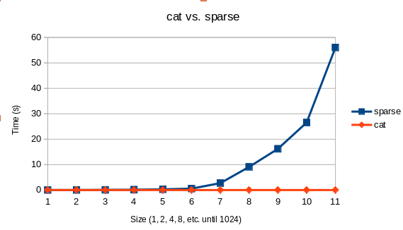

# System Calls

## Assignment 1: *Echo*

The output is as follows:

```
pi@pi-logmans:~/week2/files $ strace ./Echo Hello World
execve("./Echo", ["./Echo", "Hello", "World"], 0x7fcb909350 /* 32 vars */) = 0
brk(NULL)                               = 0x557365d000
faccessat(AT_FDCWD, "/etc/ld.so.preload", R_OK) = -1 ENOENT (No such file or directory)
openat(AT_FDCWD, "/etc/ld.so.cache", O_RDONLY|O_CLOEXEC) = 3
fstat(3, {st_mode=S_IFREG|0644, st_size=72939, ...}) = 0
mmap(NULL, 72939, PROT_READ, MAP_PRIVATE, 3, 0) = 0x7faafb1000
close(3)                                = 0
openat(AT_FDCWD, "/lib/aarch64-linux-gnu/libc.so.6", O_RDONLY|O_CLOEXEC) = 3
read(3, "\177ELF\2\1\1\3\0\0\0\0\0\0\0\0\3\0\267\0\1\0\0\0`\17\2\0\0\0\0\0"..., 832) = 832
fstat(3, {st_mode=S_IFREG|0755, st_size=1455120, ...}) = 0
mmap(NULL, 8192, PROT_READ|PROT_WRITE, MAP_PRIVATE|MAP_ANONYMOUS, -1, 0) = 0x7faafef000
mmap(NULL, 1527752, PROT_READ|PROT_EXEC, MAP_PRIVATE|MAP_DENYWRITE, 3, 0) = 0x7faae3c000
mprotect(0x7faaf99000, 61440, PROT_NONE) = 0
mmap(0x7faafa8000, 24576, PROT_READ|PROT_WRITE, MAP_PRIVATE|MAP_FIXED|MAP_DENYWRITE, 3, 0x15c000) = 0x7faafa8000
mmap(0x7faafae000, 12232, PROT_READ|PROT_WRITE, MAP_PRIVATE|MAP_FIXED|MAP_ANONYMOUS, -1, 0) = 0x7faafae000
close(3)                                = 0
mprotect(0x7faafa8000, 16384, PROT_READ) = 0
mprotect(0x55587e0000, 4096, PROT_READ) = 0
mprotect(0x7faaff4000, 4096, PROT_READ) = 0
munmap(0x7faafb1000, 72939)             = 0
fstat(1, {st_mode=S_IFCHR|0620, st_rdev=makedev(0x88, 0), ...}) = 0
brk(NULL)                               = 0x557365d000
brk(0x557367e000)                       = 0x557367e000
write(1, "./Echo Hello World (3)\n", 23./Echo Hello World (3)
) = 23
exit_group(0)                           = ?
+++ exited with 0 +++
```

Where only the following calls are specific to the program:

```
brk(NULL)                               = 0x557365d000
brk(0x557367e000)                       = 0x557367e000
write(1, "./Echo Hello World (3)\n", 23./Echo Hello World (3)
) = 23
```

All other commands are for the program initialization.

There is one function from a library: `printf()` from `stdio.h`. This is translated to a syscall `write()` from the `util-linux` package. From this it can be deducted that library calls are compiled to system calls, but system calls can also be in system libraries.

# Scheduling

## Assignment 2: *Loop*

By changing `N` to `1400` it takes 10.9 seconds to execute on my Pi.

## Assignment 3: *SchedXY*

As I could not observe any difference in scheduling I started a lot more processes: `sudo ./RR80& sudo ./RR80& sudo ./RR80& sudo ./RR80& sudo ./FIFO80& sudo ./FIFO80&`. From this it could be observed that the FIFO processes finished earlier than the Round-Robin processes, even though they were started later. While the observation was quite hard because `htop` had trouble transmitting over SSH with this load, I believe that the Round-Robin processes yielded to the FIFO processes and these then hogged the CPU until they were done.

## Assignment 4: *Nice*

`Nice.c` creates a lot of processes and assigns them different priorities. From `htop` and the output file it can be seen that the processes finish in their order of priority. However, all processes are executed on the same processor. With the extra argument it shuffles the priorities around.

# I/O

## Assignment 5: *wiringpi*

```
+-----+-----+---------+------+---+---Pi 4B--+---+------+---------+-----+-----+
 | BCM | wPi |   Name  | Mode | V | Physical | V | Mode | Name    | wPi | BCM |
 +-----+-----+---------+------+---+----++----+---+------+---------+-----+-----+
 |     |     |    3.3v |      |   |  1 || 2  |   |      | 5v      |     |     |
 |   2 |   8 |   SDA.1 |   IN | 1 |  3 || 4  |   |      | 5v      |     |     |
 |   3 |   9 |   SCL.1 |   IN | 1 |  5 || 6  |   |      | 0v      |     |     |
 |   4 |   7 | GPIO. 7 |   IN | 1 |  7 || 8  | 1 | IN   | TxD     | 15  | 14  |
 |     |     |      0v |      |   |  9 || 10 | 1 | IN   | RxD     | 16  | 15  |
 |  17 |   0 | GPIO. 0 |   IN | 0 | 11 || 12 | 0 | IN   | GPIO. 1 | 1   | 18  |
 |  27 |   2 | GPIO. 2 |   IN | 0 | 13 || 14 |   |      | 0v      |     |     |
 |  22 |   3 | GPIO. 3 |   IN | 0 | 15 || 16 | 0 | IN   | GPIO. 4 | 4   | 23  |
 |     |     |    3.3v |      |   | 17 || 18 | 0 | IN   | GPIO. 5 | 5   | 24  |
 |  10 |  12 |    MOSI |   IN | 0 | 19 || 20 |   |      | 0v      |     |     |
 |   9 |  13 |    MISO |   IN | 0 | 21 || 22 | 0 | IN   | GPIO. 6 | 6   | 25  |
 |  11 |  14 |    SCLK |   IN | 0 | 23 || 24 | 1 | IN   | CE0     | 10  | 8   |
 |     |     |      0v |      |   | 25 || 26 | 1 | IN   | CE1     | 11  | 7   |
 |   0 |  30 |   SDA.0 |   IN | 1 | 27 || 28 | 1 | IN   | SCL.0   | 31  | 1   |
 |   5 |  21 | GPIO.21 |   IN | 1 | 29 || 30 |   |      | 0v      |     |     |
 |   6 |  22 | GPIO.22 |   IN | 1 | 31 || 32 | 0 | IN   | GPIO.26 | 26  | 12  |
 |  13 |  23 | GPIO.23 |   IN | 0 | 33 || 34 |   |      | 0v      |     |     |
 |  19 |  24 | GPIO.24 |   IN | 0 | 35 || 36 | 0 | IN   | GPIO.27 | 27  | 16  |
 |  26 |  25 | GPIO.25 |   IN | 0 | 37 || 38 | 0 | IN   | GPIO.28 | 28  | 20  |
 |     |     |      0v |      |   | 39 || 40 | 0 | IN   | GPIO.29 | 29  | 21  |
 +-----+-----+---------+------+---+----++----+---+------+---------+-----+-----+
 | BCM | wPi |   Name  | Mode | V | Physical | V | Mode | Name    | wPi | BCM |
 +-----+-----+---------+------+---+---Pi 4B--+---+------+---------+-----+-----+
 ```

 This describes the properties of all the GPIO pins on the RPi. A small explanation of all the types of pins:

 ```
0v: ground
3.3v: 3.3V output
5v: 5V output
SDA: Serial Data (I2C)
SDC: Serial Clock (I2C)
TxD: UART transmit
RxD: UART receive
MOSI: Master Out, Slave In (SPI)
MISO: Master In, Slave Out (SPI)
SCLK: SPI clock
GPIO: General Purpose I/O pins
 ```

## Assignment 6: *GPIO*

I wrote the following script:

```bash
#!/bin/bash

gpio mode 0 output;
while [ true ]
do
  gpio toggle 0;
  sleep $1;
done
```

Where the sleep time can be passed as an argument (e.g. `bash blink.sh 2m` for toggling every two minutes).


## Assignment 7: *Light dependent resistor*

I wrote the following script:

```bash
#!/bin/bash

gpio mode 0 output;
gpio mode 1 input;

gpio write 0 1;

time=0;

read=$(gpio read 1);
until [ $read -gt 0 ]
do
  sleep 0.1;
  read=$(gpio read 1);
  ((time++));
done

gpio write 0 0;

echo Ticks: $time;

echo "Capacitor had output!"
```

And made the following circuit:


However, upon execution it would consistently exit immediately saying it had received a charge. But when removing the capacitor and shorting the circuit at a certain moment by hand it would measure it perfectly fine. Are any components broken? I can't tell because I don't have a multimeter here...

## Assignment 8: *Blink*

When implementing `sched_getscheduler(0)` it returns `null`. I cannot find which scheduler class this program uses. However, based on the system load the program may indeed start to slightly mess up the timings. This mainly happens when the actual commands (not the delays) are slightly postponed by the CPU.

## Assignment 9: *Sparse*

The following graph was made:



`Sparse` has a constant time to output, while `cat` scales linearly with the size of the file.

Sparse files do not write the null contents to the disk and merely write this in the metadata. This siginificantly speeds up the write speed as barely anything needs to be written.

## Assignment 10: *Fadvise*

| Time (s) |     | a/out Foo | Foo Foo1 | a.out Bar x | Bar Bar1 |
|----------|-----|-----------|----------|-------------|----------|
| real     |     | 3.076     | 20.958   | 53.022      | 37.822   |
| user     |     | 1.257     | 0.008    | 1.341       | 0.004    |
| sys      |     | 1.801     | 2.000    | 2.788       | 2.887    |
| cached   | 684 | 1198      | 1712     | 1713        | 2728     |

As can be seen, the number of cached blocks goes up rapidly after every copy, except after `./a.out Bar x` where the number of cached blocks is practically equivalent. This is because the `x` makes `a.out` advise the kernel to release the cached blocks with `posix_fadvise(out, 0,0,POSIX_FADV_DONTNEED)`.

## Assignment 11: *ln.sh*

First file `a` is created. Then a link to `a` is created with the name `b`. This is the output of the `ls` command:

```
525310 -rw-r--r-- 2 pi pi 12 Oct 22 15:07 a
525310 -rw-r--r-- 2 pi pi 12 Oct 22 15:07 b
```

Then `a` is removed. `cat b` is called, which still outputs `Hello World` as a hard link still points to the original data which is still saved. `b` is linked to  `a` and `ls` is called again. `c` is symbollically linked to `a` and then printed. Then both `a` and `b` are removed.

```
525313 lrwxrwxrwx 1 pi pi 1 Oct 22 15:07 c -> a
```

Then `c` is printed which fails as there is no `a` anymore (symbolic link is not linked to the underlying inode). Then "Hello World" is put into `a` again and now both `a` and `c` exist again:

```
525310 -rw-r--r-- 1 pi pi 12 Oct 22 15:07 a
525313 lrwxrwxrwx 1 pi pi  1 Oct 22 15:07 c -> a
```

And `c` can be printed again.


## Assignment 12: *Pipe.c*

Compiling and running:

```
pi@pi-logmans:~/week2/files $ gcc Pipe.c -o Pipe
pi@pi-logmans:~/week2/files $ ./Pipe 
parent 1993736118
child  1993736118
pi@pi-logmans:~/week2/files $ ./Pipe 
parent 617779697
child  617779697
pi@pi-logmans:~/week2/files $ ./Pipe 
parent 2147223427
child  2147223427
pi@pi-logmans:~/week2/files $ ./Pipe 
parent 767309244
child  767309244
pi@pi-logmans:~/week2/files $ ./Pipe 
parent 1537864310
child  1537864310
pi@pi-logmans:~/week2/files $ ./Pipe 
parent 163113288
child  163113288
```

This program creates a pipe (unidirectional), spawns a fork, closes the pipe on the read end for the parent process (`fd[0]` is read end) and writes a random number. This is why the output is different every time. The child process closes the write end (`fd[1]`) of the pipe and reads+prints the message in the pipe which is the random number generated by the parent.

There are four closes because every pipe has two ends per fork: a read end and a write end. Two processes * two ends = four closes to close them all.

## Assignment 13: *Fifo.c*

`Fifo.c` uses named pipes which appear as a file on the sysem (which is how one can see it with `ls`). The program can open the pipe (with read or write access) based on the name instead of depending on the variable created in the creating process. In this case the pipe was called `fifo` and the child and parent open the pipe based on this name.

## Assignment 14: *Readdir.c*

I wrote the following program:

```C
/*  Readdir.c - Read the current working directory */

#include <dirent.h>
#include <errno.h>
#include <stdio.h>
#include <string.h>
#include <sys/types.h>
#include <sys/stat.h>
#include <fcntl.h>

int main(int argc, char * argv[]) {
    if(argc>=2) {
        DIR *dirp = opendir(argv[1]) ;
        if ( dirp != NULL ) {
            struct dirent *dp ;
            while ((dp = readdir(dirp))) {
                char t;
                switch( dp->d_type ) {
                    case DT_BLK     : t = 'b' ; break ;
                    case DT_CHR     : t = 'c' ; break ;
                    case DT_DIR     : t = 'd' ; break ;
                    case DT_FIFO    : t = 'p' ; break ;
                    case DT_LNK     : t = 'l' ; break ;
                    case DT_REG     : t = '-' ;
			// printf("File d_name: %s\n", dp->d_name);
			struct stat buffer;
			int status;
			status = stat(strcat(argv[1], dp->d_name), &buffer);
			if(status == 0) {
			    printf("%s size: %d\n", dp->d_name, buffer.st_size);
			}
			break;
                    case DT_SOCK    : t = 's' ; break ;
                    case DT_UNKNOWN : t = 'u' ; break ;
                    default         : t = '?' ;
                }
                printf("%8d %c %s\n", (int)dp->d_ino, t, dp->d_name);
            }
            closedir(dirp);
        }
        return 0;
    } else {
        printf("usage: %s dir\n", argv[0]);
        return 1;
    }
}
```

If the file is a regular file it will use `stat()` on the directory+file name (concatenated) to retrieve information on the file, and if succesful (`status == 0`) it will print the file name with its size.

## Assignment 15: *fdisk*

```
pi@pi-logmans:~ $ sudo fdisk -l
Disk /dev/ram0: 4 MiB, 4194304 bytes, 8192 sectors
Units: sectors of 1 * 512 = 512 bytes
Sector size (logical/physical): 512 bytes / 4096 bytes
I/O size (minimum/optimal): 4096 bytes / 4096 bytes


(...)


Disk /dev/ram15: 4 MiB, 4194304 bytes, 8192 sectors
Units: sectors of 1 * 512 = 512 bytes
Sector size (logical/physical): 512 bytes / 4096 bytes
I/O size (minimum/optimal): 4096 bytes / 4096 bytes


Disk /dev/mmcblk0: 29.12 GiB, 31267487744 bytes, 61069312 sectors
Units: sectors of 1 * 512 = 512 bytes
Sector size (logical/physical): 512 bytes / 512 bytes
I/O size (minimum/optimal): 512 bytes / 512 bytes
Disklabel type: dos
Disk identifier: 0x58271277

Device         Boot  Start      End  Sectors  Size Id Type
/dev/mmcblk0p1        8192   532479   524288  256M  c W95 FAT32 (LBA)
/dev/mmcblk0p2      532480 61069311 60536832 28.9G 83 Linux
```

Then after insertion of the USB stick.

```
pi@pi-logmans:~ $ sudo fdisk -l
Disk /dev/ram0: 4 MiB, 4194304 bytes, 8192 sectors
Units: sectors of 1 * 512 = 512 bytes
Sector size (logical/physical): 512 bytes / 4096 bytes
I/O size (minimum/optimal): 4096 bytes / 4096 bytes


(...))


Disk /dev/ram15: 4 MiB, 4194304 bytes, 8192 sectors
Units: sectors of 1 * 512 = 512 bytes
Sector size (logical/physical): 512 bytes / 4096 bytes
I/O size (minimum/optimal): 4096 bytes / 4096 bytes


Disk /dev/mmcblk0: 29.12 GiB, 31267487744 bytes, 61069312 sectors
Units: sectors of 1 * 512 = 512 bytes
Sector size (logical/physical): 512 bytes / 512 bytes
I/O size (minimum/optimal): 512 bytes / 512 bytes
Disklabel type: dos
Disk identifier: 0x58271277

Device         Boot  Start      End  Sectors  Size Id Type
/dev/mmcblk0p1        8192   532479   524288  256M  c W95 FAT32 (LBA)
/dev/mmcblk0p2      532480 61069311 60536832 28.9G 83 Linux


Disk /dev/sda: 7.45 GiB, 8004304896 bytes, 15633408 sectors
Disk model: Cruzer Switch   
Units: sectors of 1 * 512 = 512 bytes
Sector size (logical/physical): 512 bytes / 512 bytes
I/O size (minimum/optimal): 512 bytes / 512 bytes
Disklabel type: dos
Disk identifier: 0xbf1af185

Device     Boot Start      End  Sectors  Size Id Type
/dev/sda1        2048 15632383 15630336  7.5G  c W95 FAT32 (LBA)
```

The USB drive is at `/dev/sda`.

## Assignment 16: *Filesystems on the pi*

```
pi@pi-logmans:~/week2/files $ df
Filesystem     1K-blocks    Used Available Use% Mounted on
/dev/root       29721124 5481672  22974680  20% /
devtmpfs         1776952       0   1776952   0% /dev
tmpfs            1942712       0   1942712   0% /dev/shm
tmpfs             777088    1388    775700   1% /run
tmpfs               5120       4      5116   1% /run/lock
/dev/mmcblk0p1    261108   31222    229886  12% /boot
tmpfs             388540      20    388520   1% /run/user/1000
/dev/sda1        7799912      84   7799828   1% /media/pi/CRUZER
```

`/sys`: a place where hardware information and drivers are stored. This was originally stored in `/proc` but has been moved to this folder in later Linux versions.

`/proc`: a place where information about hardware and current running processes is stored.

`/dev/root`: a link to the device on which the system is installed.

`devtmpfs`: stores the locations of devices and special files. This is in RAM and temporary (it gets generated at boot and updated during runtime).

`tmpfs`: general temporary file system used for caching. Kind of a mix between a RAM disk and persistent storage.

`/dev/mmcblk0p1`: the SD card

`dev/sda1`: the USB drive

## Assignment 18: *Mount.c*

```
pi@pi-logmans:~/week2/files $ sudo mkdir /mnt/usb
pi@pi-logmans:~/week2/files $ sudo mount -t vfat /dev/sda1 /mnt/usb
pi@pi-logmans:~/week2/files $ ls -l /mnt/usb
total 72
-rw-r--r-- 1 pi pi 66248 Oct 17 12:36 'IMMI Grant Notification-1.pdf'
drwxr-xr-x 2 pi pi  4096 Jun 25  2021 'System Volume Information'
```

After compiling `Mount.c`:

```
pi@pi-logmans:~/week2/files $ ./Mount $HOME
//home/pi not mounted
//home not mounted
/ mounted on /dev/root
```

```
pi@pi-logmans:~/week2/files $ ./Mount /mnt/usb
//mnt/usb mounted on /dev/sda1
//mnt not mounted
/ mounted on /dev/root
```

As can be seen it indeeds shows the USB drive to be mounted on `/dev/sda1`, where `/home` is not mounted here. However, both are mounted on `/dev/root`.

## Assignment 18: *Unplug*

By using the following commands:

```bash
umount /dev/sda1
sudo eject /dev/sda1
```

Where all mounts must be unmounted before ejection. The filepath may differ obviously.

## Assignment 19: *Fadvise*

Mounting using `sudo mount -t vfat /dev/sda1 /mnt/usb`.

| Time | SD      | USB       |
|------|---------|-----------|
| real | 25.429s | 2m24.849s |
| user | 1.268s  | 1.353s    |
| sys  | 2.614s  | 3.401s    |

As can be seen the SD card is much faster.

## Assignment 20: *Ext4*

Before being able to reformat I had to unmount the USB drive. Then:

```
pi@pi-logmans:/ $ sudo mkfs.ext4 /dev/sda1
mke2fs 1.46.2 (28-Feb-2021)
/dev/sda1 contains a vfat file system labelled 'CRUZER'
Proceed anyway? (y,N) y
Creating filesystem with 1953792 4k blocks and 488640 inodes
Filesystem UUID: ba191f8b-0415-4e61-b07b-9329db37fd14
Superblock backups stored on blocks: 
	32768, 98304, 163840, 229376, 294912, 819200, 884736, 1605632

Allocating group tables: done                            
Writing inode tables: done                            
Creating journal (16384 blocks): done
Writing superblocks and filesystem accounting information: done
```

Then after mounting I created the random content:

```
pi@pi-logmans:/ $ sudo dd if=/dev/urandom of=/mnt/usb/100m-rnd.raw bs=1M count=100
100+0 records in
100+0 records out
104857600 bytes (105 MB, 100 MiB) copied, 0.996088 s, 105 MB/s
```

Then unmounting and mounting it:

```
pi@pi-logmans:/ $ sudo umount /mnt/usb
pi@pi-logmans:/ $ sudo eject /dev/sda1
# I unplugged and reinserted the USB drive here
pi@pi-logmans:/ $ sudo mount -t ext4 /dev/sda1 /mnt/usb
```

Then reading:

```
pi@pi-logmans:/ $ sudo dd if=/mnt/usb/100m-rnd.raw of=/dev/null bs=1M
100+0 records in
100+0 records out
104857600 bytes (105 MB, 100 MiB) copied, 4.77784 s, 21.9 MB/s
```

This took 4.8 seconds.

Doing it again was much faster as the data has already been cached:

```
pi@pi-logmans:/ $ sudo dd if=/mnt/usb/100m-rnd.raw of=/dev/null bs=1M
100+0 records in
100+0 records out
104857600 bytes (105 MB, 100 MiB) copied, 0.110222 s, 951 MB/s
```

## Assignment 21: *Ext4 read and write*

`dd` does not write to the USB drive.

## Assignment 22: *Backup ext4*

This is a very risky strategy as `dd` will read files as they're being modified (possibly by the OS) which may lead to weird scenarios the OS is not prepared to deal with. Backing up a live system is very hard and usually done with snapshots (if enabled/available).

## Assignment 23: *Unsafe removal*

```
pi@pi-logmans:~/week2/files $ ./readFromFile /mnt/usb/100m-rnd.raw 
Remove the USB thumb drive now!
9 # I removed the drive here
8 
7
6
5
4
3
2
1
0
Read 104857600 bytes from the file!
```

I read about 10% of the file as it was only present for about 10% of the time.

## Assignment 24: *tail -f*

`tail -f` creates an `inotify` instance which provides a mechanism for monitoring filesystem event. In this case the `inotify` instance will create an event when the monitored file is modified and `tail -f` will write the change to the terminal

# Kernel

## Assignment 25: *lsmod*

```
pi@pi-logmans:~ $ lsmod
Module                  Size  Used by
sg                     36864  0
rfcomm                 53248  4
cmac                   16384  3
algif_hash             20480  1
aes_arm64              16384  3
aes_generic            36864  1 aes_arm64
algif_skcipher         20480  1
af_alg                 32768  6 algif_hash,algif_skcipher
bnep                   28672  2
hci_uart               53248  1
btbcm                  28672  1 hci_uart
bluetooth             454656  31 hci_uart,btbcm,bnep,rfcomm
ecdh_generic           16384  2 bluetooth
ecc                    36864  1 ecdh_generic
libaes                 16384  3 aes_arm64,bluetooth,aes_generic
8021q                  32768  0
garp                   16384  1 8021q
stp                    20480  1 garp
llc                    20480  2 stp,garp
brcmfmac              335872  0
snd_soc_hdmi_codec     20480  2
brcmutil               24576  1 brcmfmac
cfg80211              868352  1 brcmfmac
rfkill                 36864  6 bluetooth,cfg80211
bcm2835_codec          53248  0
bcm2835_v4l2           45056  0
bcm2835_isp            32768  0
vc4                   311296  11
v3d                    90112  8
rpivid_hevc            57344  0
raspberrypi_hwmon      16384  0
v4l2_mem2mem           40960  2 bcm2835_codec,rpivid_hevc
bcm2835_mmal_vchiq     40960  3 bcm2835_codec,bcm2835_v4l2,bcm2835_isp
cec                    57344  1 vc4
videobuf2_vmalloc      20480  1 bcm2835_v4l2
videobuf2_dma_contig    24576  3 bcm2835_codec,rpivid_hevc,bcm2835_isp
gpu_sched              40960  1 v3d
drm_kms_helper        286720  2 vc4
videobuf2_memops       20480  2 videobuf2_vmalloc,videobuf2_dma_contig
videobuf2_v4l2         32768  5 bcm2835_codec,bcm2835_v4l2,rpivid_hevc,v4l2_mem2mem,bcm2835_isp
videobuf2_common       69632  9 bcm2835_codec,videobuf2_vmalloc,videobuf2_dma_contig,videobuf2_v4l2,bcm2835_v4l2,rpivid_hevc,v4l2_mem2mem,videobuf2_memops,bcm2835_isp
snd_soc_core          253952  2 vc4,snd_soc_hdmi_codec
videodev              262144  7 bcm2835_codec,videobuf2_v4l2,bcm2835_v4l2,videobuf2_common,rpivid_hevc,v4l2_mem2mem,bcm2835_isp
snd_compress           20480  1 snd_soc_core
snd_bcm2835            28672  1
snd_pcm_dmaengine      20480  1 snd_soc_core
i2c_brcmstb            16384  0
vc_sm_cma              40960  2 bcm2835_mmal_vchiq,bcm2835_isp
snd_pcm               139264  5 snd_bcm2835,snd_soc_hdmi_codec,snd_compress,snd_soc_core,snd_pcm_dmaengine
mc                     61440  7 videodev,bcm2835_codec,videobuf2_v4l2,videobuf2_common,rpivid_hevc,v4l2_mem2mem,bcm2835_isp
snd_timer              36864  1 snd_pcm
snd                   106496  8 snd_bcm2835,snd_soc_hdmi_codec,snd_timer,snd_compress,snd_soc_core,snd_pcm
syscopyarea            16384  1 drm_kms_helper
sysfillrect            16384  1 drm_kms_helper
sysimgblt              16384  1 drm_kms_helper
fb_sys_fops            16384  1 drm_kms_helper
uio_pdrv_genirq        16384  0
nvmem_rmem             16384  0
uio                    24576  1 uio_pdrv_genirq
drm                   577536  14 gpu_sched,drm_kms_helper,v3d,vc4
i2c_dev                20480  0
fuse                  135168  3
drm_panel_orientation_quirks    24576  1 drm
backlight              24576  2 drm_kms_helper,drm
ip_tables              32768  0
x_tables               49152  1 ip_tables
ipv6                  561152  42
```

However, I had quite some trouble loading the `btrfs` module: see the following output:

```
pi@pi-logmans:/lib/modules/5.15.61-v8+/kernel/fs/btrfs $ sudo !!
sudo modprobe btrfs
modprobe: ERROR: could not insert 'btrfs': Unknown symbol in module, or unknown parameter (see dmesg)
```

And in `dmesg`:

```
[14484.300557] btrfs: Unknown symbol raid6_2data_recov (err -2)
[14484.300966] btrfs: Unknown symbol ZSTD_CStreamWorkspaceBound (err -2)
[14484.301045] btrfs: Unknown symbol raid6_datap_recov (err -2)
[14484.301224] btrfs: Unknown symbol ZSTD_compressStream (err -2)
[14484.301657] btrfs: Unknown symbol xor_blocks (err -2)
[14484.301701] btrfs: Unknown symbol raid6_call (err -2)
[14484.301931] btrfs: Unknown symbol ZSTD_endStream (err -2)
[14484.301988] btrfs: Unknown symbol ZSTD_initCStream (err -2)
[14484.302003] btrfs: Unknown symbol ZSTD_getParams (err -2)
[14545.690064] btrfs: Unknown symbol raid6_2data_recov (err -2)
[14545.690489] btrfs: Unknown symbol ZSTD_CStreamWorkspaceBound (err -2)
[14545.690566] btrfs: Unknown symbol raid6_datap_recov (err -2)
[14545.690744] btrfs: Unknown symbol ZSTD_compressStream (err -2)
[14545.691172] btrfs: Unknown symbol xor_blocks (err -2)
[14545.691217] btrfs: Unknown symbol raid6_call (err -2)
[14545.691447] btrfs: Unknown symbol ZSTD_endStream (err -2)
[14545.691502] btrfs: Unknown symbol ZSTD_initCStream (err -2)
[14545.691518] btrfs: Unknown symbol ZSTD_getParams (err -2)
[14578.234724] raid6: neonx8   gen()  2469 MB/s
[14578.302751] raid6: neonx8   xor()  1776 MB/s
[14578.370740] raid6: neonx4   gen()  4569 MB/s
[14578.438706] raid6: neonx4   xor()  3352 MB/s
[14578.506706] raid6: neonx2   gen()  4127 MB/s
[14578.574704] raid6: neonx2   xor()  3047 MB/s
[14578.642697] raid6: neonx1   gen()  3206 MB/s
[14578.710700] raid6: neonx1   xor()  2455 MB/s
[14578.778710] raid6: int64x8  gen()  3075 MB/s
[14578.846704] raid6: int64x8  xor()  1764 MB/s
[14578.914703] raid6: int64x4  gen()  3007 MB/s
[14578.982685] raid6: int64x4  xor()  1782 MB/s
[14579.050683] raid6: int64x2  gen()  2800 MB/s
[14579.118681] raid6: int64x2  xor()  1578 MB/s
[14579.186681] raid6: int64x1  gen()  2171 MB/s
[14579.254684] raid6: int64x1  xor()  1177 MB/s
[14579.254689] raid6: using algorithm neonx4 gen() 4569 MB/s
[14579.254693] raid6: .... xor() 3352 MB/s, rmw enabled
[14579.254697] raid6: using neon recovery algorithm
[14579.270613] xor: measuring software checksum speed
[14579.271981]    8regs           :  7612 MB/sec
[14579.273120]    32regs          :  8778 MB/sec
[14579.275946]    arm64_neon      :  3588 MB/sec
[14579.275957] xor: using function: 32regs (8778 MB/sec)
```

I have not been able to solve this issue. I also tried using  `sudo insmod /lib/modules/5.15.61-v8+/kernel/fs/btrfs/btrfs.ko`, but this crashed with the same error.

Regardless, by doing `lsmod` again one should be able to find the loaded module (using `grep` might make this easier). A module can be removed by doing `modprobe -r <module name>`.

## Sparse logs
```
pi@pi-logmans:~/week2/files $ bash -x sparse.sh > sparse.log
+ /bin/rm -rf sparse.dir
+ mkdir sparse.dir
+ cd sparse.dir
+ gcc ../Sparse.c
+ for d in . /tmp
+ for i in 1 2 4 8 16 32 64 128 256 512 1024
+ echo 'Now in pass 1 in .'
+ /bin/rm -rf ./1.dat
+ ./a.out ./1.dat 1

real	0m0.002s
user	0m0.002s
sys	0m0.000s
+ cat ./1.dat

real	0m0.008s
user	0m0.000s
sys	0m0.008s
+ ls -l ./1.dat ./junk
+ du ./1.dat ./junk
+ /bin/rm -rf ./1.dat
+ for i in 1 2 4 8 16 32 64 128 256 512 1024
+ echo 'Now in pass 2 in .'
+ /bin/rm -rf ./2.dat
+ ./a.out ./2.dat 2

real	0m0.002s
user	0m0.000s
sys	0m0.002s
+ cat ./2.dat

real	0m0.016s
user	0m0.000s
sys	0m0.015s
+ ls -l ./2.dat ./junk
+ du ./2.dat ./junk
+ /bin/rm -rf ./2.dat
+ for i in 1 2 4 8 16 32 64 128 256 512 1024
+ echo 'Now in pass 4 in .'
+ /bin/rm -rf ./4.dat
+ ./a.out ./4.dat 4

real	0m0.002s
user	0m0.000s
sys	0m0.002s
+ cat ./4.dat

real	0m0.073s
user	0m0.000s
sys	0m0.028s
+ ls -l ./4.dat ./junk
+ du ./4.dat ./junk
+ /bin/rm -rf ./4.dat
+ for i in 1 2 4 8 16 32 64 128 256 512 1024
+ echo 'Now in pass 8 in .'
+ /bin/rm -rf ./8.dat
+ ./a.out ./8.dat 8

real	0m0.002s
user	0m0.001s
sys	0m0.001s
+ cat ./8.dat

real	0m0.136s
user	0m0.000s
sys	0m0.052s
+ ls -l ./8.dat ./junk
+ du ./8.dat ./junk
+ /bin/rm -rf ./8.dat
+ for i in 1 2 4 8 16 32 64 128 256 512 1024
+ echo 'Now in pass 16 in .'
+ /bin/rm -rf ./16.dat
+ ./a.out ./16.dat 16

real	0m0.002s
user	0m0.000s
sys	0m0.002s
+ cat ./16.dat

real	0m0.283s
user	0m0.000s
sys	0m0.100s
+ ls -l ./16.dat ./junk
+ du ./16.dat ./junk
+ /bin/rm -rf ./16.dat
+ for i in 1 2 4 8 16 32 64 128 256 512 1024
+ echo 'Now in pass 32 in .'
+ /bin/rm -rf ./32.dat
+ ./a.out ./32.dat 32

real	0m0.002s
user	0m0.002s
sys	0m0.000s
+ cat ./32.dat

real	0m0.575s
user	0m0.001s
sys	0m0.192s
+ ls -l ./32.dat ./junk
+ du ./32.dat ./junk
+ /bin/rm -rf ./32.dat
+ for i in 1 2 4 8 16 32 64 128 256 512 1024
+ echo 'Now in pass 64 in .'
+ /bin/rm -rf ./64.dat
+ ./a.out ./64.dat 64

real	0m0.002s
user	0m0.001s
sys	0m0.000s
+ cat ./64.dat

real	0m2.720s
user	0m0.004s
sys	0m0.376s
+ ls -l ./64.dat ./junk
+ du ./64.dat ./junk
+ /bin/rm -rf ./64.dat
+ for i in 1 2 4 8 16 32 64 128 256 512 1024
+ echo 'Now in pass 128 in .'
+ /bin/rm -rf ./128.dat
+ ./a.out ./128.dat 128

real	0m0.002s
user	0m0.001s
sys	0m0.000s
+ cat ./128.dat

real	0m9.105s
user	0m0.000s
sys	0m0.850s
+ ls -l ./128.dat ./junk
+ du ./128.dat ./junk
+ /bin/rm -rf ./128.dat
+ for i in 1 2 4 8 16 32 64 128 256 512 1024
+ echo 'Now in pass 256 in .'
+ /bin/rm -rf ./256.dat
+ ./a.out ./256.dat 256

real	0m0.002s
user	0m0.001s
sys	0m0.001s
+ cat ./256.dat

real	0m16.209s
user	0m0.013s
sys	0m1.634s
+ ls -l ./256.dat ./junk
+ du ./256.dat ./junk
+ /bin/rm -rf ./256.dat
+ for i in 1 2 4 8 16 32 64 128 256 512 1024
+ echo 'Now in pass 512 in .'
+ /bin/rm -rf ./512.dat
+ ./a.out ./512.dat 512

real	0m0.002s
user	0m0.002s
sys	0m0.000s
+ cat ./512.dat

real	0m26.545s
user	0m0.004s
sys	0m2.988s
+ ls -l ./512.dat ./junk
+ du ./512.dat ./junk
+ /bin/rm -rf ./512.dat
+ for i in 1 2 4 8 16 32 64 128 256 512 1024
+ echo 'Now in pass 1024 in .'
+ /bin/rm -rf ./1024.dat
+ ./a.out ./1024.dat 1024

real	0m0.002s
user	0m0.001s
sys	0m0.001s
+ cat ./1024.dat

real	0m56.028s
user	0m0.006s
sys	0m5.879s
+ ls -l ./1024.dat ./junk
+ du ./1024.dat ./junk
+ /bin/rm -rf ./1024.dat
+ for d in . /tmp
+ for i in 1 2 4 8 16 32 64 128 256 512 1024
+ echo 'Now in pass 1 in /tmp'
+ /bin/rm -rf /tmp/1.dat
+ ./a.out /tmp/1.dat 1

real	0m0.002s
user	0m0.001s
sys	0m0.001s
+ cat /tmp/1.dat

real	0m0.009s
user	0m0.000s
sys	0m0.008s
+ ls -l /tmp/1.dat /tmp/junk
+ du /tmp/1.dat /tmp/junk
+ /bin/rm -rf /tmp/1.dat
+ for i in 1 2 4 8 16 32 64 128 256 512 1024
+ echo 'Now in pass 2 in /tmp'
+ /bin/rm -rf /tmp/2.dat
+ ./a.out /tmp/2.dat 2

real	0m0.002s
user	0m0.001s
sys	0m0.001s
+ cat /tmp/2.dat

real	0m0.016s
user	0m0.000s
sys	0m0.017s
+ ls -l /tmp/2.dat /tmp/junk
+ du /tmp/2.dat /tmp/junk
+ /bin/rm -rf /tmp/2.dat
+ for i in 1 2 4 8 16 32 64 128 256 512 1024
+ echo 'Now in pass 4 in /tmp'
+ /bin/rm -rf /tmp/4.dat
+ ./a.out /tmp/4.dat 4

real	0m0.002s
user	0m0.000s
sys	0m0.002s
+ cat /tmp/4.dat

real	0m3.011s
user	0m0.000s
sys	0m0.031s
+ ls -l /tmp/4.dat /tmp/junk
+ du /tmp/4.dat /tmp/junk
+ /bin/rm -rf /tmp/4.dat
+ for i in 1 2 4 8 16 32 64 128 256 512 1024
+ echo 'Now in pass 8 in /tmp'
+ /bin/rm -rf /tmp/8.dat
+ ./a.out /tmp/8.dat 8

real	0m0.002s
user	0m0.000s
sys	0m0.002s
+ cat /tmp/8.dat

real	0m0.146s
user	0m0.000s
sys	0m0.060s
+ ls -l /tmp/8.dat /tmp/junk
+ du /tmp/8.dat /tmp/junk
+ /bin/rm -rf /tmp/8.dat
+ for i in 1 2 4 8 16 32 64 128 256 512 1024
+ echo 'Now in pass 16 in /tmp'
+ /bin/rm -rf /tmp/16.dat
+ ./a.out /tmp/16.dat 16

real	0m0.002s
user	0m0.001s
sys	0m0.001s
+ cat /tmp/16.dat

real	0m0.364s
user	0m0.000s
sys	0m0.111s
+ ls -l /tmp/16.dat /tmp/junk
+ du /tmp/16.dat /tmp/junk
+ /bin/rm -rf /tmp/16.dat
+ for i in 1 2 4 8 16 32 64 128 256 512 1024
+ echo 'Now in pass 32 in /tmp'
+ /bin/rm -rf /tmp/32.dat
+ ./a.out /tmp/32.dat 32

real	0m0.002s
user	0m0.001s
sys	0m0.001s
+ cat /tmp/32.dat

real	0m1.582s
user	0m0.004s
sys	0m0.239s
+ ls -l /tmp/32.dat /tmp/junk
+ du /tmp/32.dat /tmp/junk
+ /bin/rm -rf /tmp/32.dat
+ for i in 1 2 4 8 16 32 64 128 256 512 1024
+ echo 'Now in pass 64 in /tmp'
+ /bin/rm -rf /tmp/64.dat
+ ./a.out /tmp/64.dat 64

real	0m0.002s
user	0m0.000s
sys	0m0.002s
+ cat /tmp/64.dat

real	0m3.026s
user	0m0.002s
sys	0m0.392s
+ ls -l /tmp/64.dat /tmp/junk
+ du /tmp/64.dat /tmp/junk
+ /bin/rm -rf /tmp/64.dat
+ for i in 1 2 4 8 16 32 64 128 256 512 1024
+ echo 'Now in pass 128 in /tmp'
+ /bin/rm -rf /tmp/128.dat
+ ./a.out /tmp/128.dat 128

real	0m0.002s
user	0m0.001s
sys	0m0.001s
+ cat /tmp/128.dat

real	0m7.779s
user	0m0.000s
sys	0m0.856s
+ ls -l /tmp/128.dat /tmp/junk
+ du /tmp/128.dat /tmp/junk
+ /bin/rm -rf /tmp/128.dat
+ for i in 1 2 4 8 16 32 64 128 256 512 1024
+ echo 'Now in pass 256 in /tmp'
+ /bin/rm -rf /tmp/256.dat
+ ./a.out /tmp/256.dat 256

real	0m0.002s
user	0m0.001s
sys	0m0.001s
+ cat /tmp/256.dat

real	0m14.810s
user	0m0.012s
sys	0m1.628s
+ ls -l /tmp/256.dat /tmp/junk
+ du /tmp/256.dat /tmp/junk
+ /bin/rm -rf /tmp/256.dat
+ for i in 1 2 4 8 16 32 64 128 256 512 1024
+ echo 'Now in pass 512 in /tmp'
+ /bin/rm -rf /tmp/512.dat
+ ./a.out /tmp/512.dat 512

real	0m0.002s
user	0m0.000s
sys	0m0.002s
+ cat /tmp/512.dat

real	0m31.187s
user	0m0.004s
sys	0m2.917s
+ ls -l /tmp/512.dat /tmp/junk
+ du /tmp/512.dat /tmp/junk
+ /bin/rm -rf /tmp/512.dat
+ for i in 1 2 4 8 16 32 64 128 256 512 1024
+ echo 'Now in pass 1024 in /tmp'
+ /bin/rm -rf /tmp/1024.dat
+ ./a.out /tmp/1024.dat 1024

real	0m0.002s
user	0m0.000s
sys	0m0.002s
+ cat /tmp/1024.dat

real	0m55.823s
user	0m0.014s
sys	0m5.847s
+ ls -l /tmp/1024.dat /tmp/junk
+ du /tmp/1024.dat /tmp/junk
+ /bin/rm -rf /tmp/1024.dat
+ cd ..
```

```
pi@pi-logmans:~/week2/files $ cat sparse.log 
Now in pass 1 in .
-rw-r--r-- 1 pi pi 1048576 Oct 21 17:32 ./1.dat
-rw-r--r-- 1 pi pi 1048576 Oct 21 17:32 ./junk
4	./1.dat
1024	./junk
Now in pass 2 in .
-rw-r--r-- 1 pi pi 2097152 Oct 21 17:32 ./2.dat
-rw-r--r-- 1 pi pi 2097152 Oct 21 17:32 ./junk
4	./2.dat
2048	./junk
Now in pass 4 in .
-rw-r--r-- 1 pi pi 4194304 Oct 21 17:32 ./4.dat
-rw-r--r-- 1 pi pi 4194304 Oct 21 17:32 ./junk
4	./4.dat
4096	./junk
Now in pass 8 in .
-rw-r--r-- 1 pi pi 8388608 Oct 21 17:32 ./8.dat
-rw-r--r-- 1 pi pi 8388608 Oct 21 17:32 ./junk
4	./8.dat
8192	./junk
Now in pass 16 in .
-rw-r--r-- 1 pi pi 16777216 Oct 21 17:32 ./16.dat
-rw-r--r-- 1 pi pi 16777216 Oct 21 17:32 ./junk
4	./16.dat
16384	./junk
Now in pass 32 in .
-rw-r--r-- 1 pi pi 33554432 Oct 21 17:32 ./32.dat
-rw-r--r-- 1 pi pi 33554432 Oct 21 17:32 ./junk
4	./32.dat
32768	./junk
Now in pass 64 in .
-rw-r--r-- 1 pi pi 67108864 Oct 21 17:32 ./64.dat
-rw-r--r-- 1 pi pi 67108864 Oct 21 17:32 ./junk
4	./64.dat
65540	./junk
Now in pass 128 in .
-rw-r--r-- 1 pi pi 134217728 Oct 21 17:32 ./128.dat
-rw-r--r-- 1 pi pi 134217728 Oct 21 17:32 ./junk
4	./128.dat
131076	./junk
Now in pass 256 in .
-rw-r--r-- 1 pi pi 268435456 Oct 21 17:32 ./256.dat
-rw-r--r-- 1 pi pi 268435456 Oct 21 17:32 ./junk
4	./256.dat
262148	./junk
Now in pass 512 in .
-rw-r--r-- 1 pi pi 536870912 Oct 21 17:32 ./512.dat
-rw-r--r-- 1 pi pi 536870912 Oct 21 17:32 ./junk
4	./512.dat
524292	./junk
Now in pass 1024 in .
-rw-r--r-- 1 pi pi 1073741824 Oct 21 17:33 ./1024.dat
-rw-r--r-- 1 pi pi 1073741824 Oct 21 17:33 ./junk
4	./1024.dat
1048580	./junk
Now in pass 1 in /tmp
-rw-r--r-- 1 pi pi 1048576 Oct 21 17:34 /tmp/1.dat
-rw-r--r-- 1 pi pi 1048576 Oct 21 17:34 /tmp/junk
4	/tmp/1.dat
1024	/tmp/junk
Now in pass 2 in /tmp
-rw-r--r-- 1 pi pi 2097152 Oct 21 17:34 /tmp/2.dat
-rw-r--r-- 1 pi pi 2097152 Oct 21 17:34 /tmp/junk
4	/tmp/2.dat
2048	/tmp/junk
Now in pass 4 in /tmp
-rw-r--r-- 1 pi pi 4194304 Oct 21 17:34 /tmp/4.dat
-rw-r--r-- 1 pi pi 4194304 Oct 21 17:34 /tmp/junk
4	/tmp/4.dat
4096	/tmp/junk
Now in pass 8 in /tmp
-rw-r--r-- 1 pi pi 8388608 Oct 21 17:34 /tmp/8.dat
-rw-r--r-- 1 pi pi 8388608 Oct 21 17:34 /tmp/junk
4	/tmp/8.dat
8192	/tmp/junk
Now in pass 16 in /tmp
-rw-r--r-- 1 pi pi 16777216 Oct 21 17:34 /tmp/16.dat
-rw-r--r-- 1 pi pi 16777216 Oct 21 17:34 /tmp/junk
4	/tmp/16.dat
16384	/tmp/junk
Now in pass 32 in /tmp
-rw-r--r-- 1 pi pi 33554432 Oct 21 17:34 /tmp/32.dat
-rw-r--r-- 1 pi pi 33554432 Oct 21 17:34 /tmp/junk
4	/tmp/32.dat
32768	/tmp/junk
Now in pass 64 in /tmp
-rw-r--r-- 1 pi pi 67108864 Oct 21 17:34 /tmp/64.dat
-rw-r--r-- 1 pi pi 67108864 Oct 21 17:34 /tmp/junk
4	/tmp/64.dat
65540	/tmp/junk
Now in pass 128 in /tmp
-rw-r--r-- 1 pi pi 134217728 Oct 21 17:34 /tmp/128.dat
-rw-r--r-- 1 pi pi 134217728 Oct 21 17:34 /tmp/junk
4	/tmp/128.dat
131076	/tmp/junk
Now in pass 256 in /tmp
-rw-r--r-- 1 pi pi 268435456 Oct 21 17:34 /tmp/256.dat
-rw-r--r-- 1 pi pi 268435456 Oct 21 17:34 /tmp/junk
4	/tmp/256.dat
262144	/tmp/junk
Now in pass 512 in /tmp
-rw-r--r-- 1 pi pi 536870912 Oct 21 17:34 /tmp/512.dat
-rw-r--r-- 1 pi pi 536870912 Oct 21 17:34 /tmp/junk
4	/tmp/512.dat
524292	/tmp/junk
Now in pass 1024 in /tmp
-rw-r--r-- 1 pi pi 1073741824 Oct 21 17:35 /tmp/1024.dat
-rw-r--r-- 1 pi pi 1073741824 Oct 21 17:35 /tmp/junk
4	/tmp/1024.dat
1048580	/tmp/junk
```

## fadvise logs

```
pi@pi-logmans:~/week2/files $ bash -x fadvise.sh > fadvise.log
+ /bin/rm -rf fadvise.dir
+ mkdir fadvise.dir
+ cd fadvise.dir
+ gcc ../Fadvise.c
+ /bin/rm -rf Foo Foo1 Bar Bar1
+ free -m
+ ./a.out Foo

real	0m3.067s
user	0m1.257s
sys	0m1.801s
+ free -m
+ cp Foo Foo1

real	0m20.958s
user	0m0.008s
sys	0m2.000s
+ free -m
+ ./a.out Bar x

real	0m53.022s
user	0m1.341s
sys	0m2.788s
+ free -m
+ cp Bar Bar1

real	0m37.822s
user	0m0.004s
sys	0m2.887s
+ free -m
+ ls -lh Foo Foo1 Bar Bar1
+ /bin/rm -rf Foo Foo1 Bar Bar1 a.out
+ cd ..
```

```
pi@pi-logmans:~/week2/files $ cat fadvise.log 
               total        used        free      shared  buff/cache   available
Mem:            3794         273        2836          35         684        3412
Swap:             99           0          99
               total        used        free      shared  buff/cache   available
Mem:            3794         271        2324          35        1198        3409
Swap:             99           0          99
               total        used        free      shared  buff/cache   available
Mem:            3794         269        1812          35        1712        3411
Swap:             99           0          99
               total        used        free      shared  buff/cache   available
Mem:            3794         269        1810          35        1713        3410
Swap:             99           0          99
               total        used        free      shared  buff/cache   available
Mem:            3794         271         795          35        2728        3409
Swap:             99           0          99
-rw-r--r-- 1 pi pi 500M Oct 22 14:39 Bar
-rw-r--r-- 1 pi pi 500M Oct 22 14:40 Bar1
-rw-r--r-- 1 pi pi 500M Oct 22 14:39 Foo
-rw-r--r-- 1 pi pi 500M Oct 22 14:39 Foo1
```

## ln log

```
pi@pi-logmans:~/week2/files $ bash -x ln.sh > ln.log
+ /bin/rm -rf ln.dir
+ mkdir ln.dir
+ cd ln.dir
+ echo 'Hello World'
+ ln a b
+ ls -li a b
+ rm a
+ cat b
+ ln b a
+ ls -li a b
+ ln -s a c
+ cat c
+ /bin/rm a b
+ ls -li c
+ cat c
cat: c: No such file or directory
+ echo 'Hello World'
+ ls -li a c
+ cat c
+ cd ..
```

```
pi@pi-logmans:~/week2/files $ cat ln.log
525310 -rw-r--r-- 2 pi pi 12 Oct 22 15:07 a
525310 -rw-r--r-- 2 pi pi 12 Oct 22 15:07 b
Hello World
525310 -rw-r--r-- 2 pi pi 12 Oct 22 15:07 a
525310 -rw-r--r-- 2 pi pi 12 Oct 22 15:07 b
Hello World
525313 lrwxrwxrwx 1 pi pi 1 Oct 22 15:07 c -> a
525310 -rw-r--r-- 1 pi pi 12 Oct 22 15:07 a
525313 lrwxrwxrwx 1 pi pi  1 Oct 22 15:07 c -> a
Hello World
```