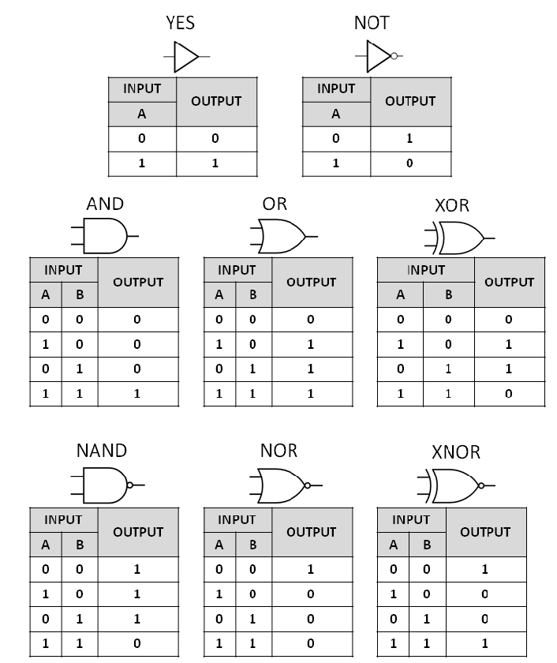
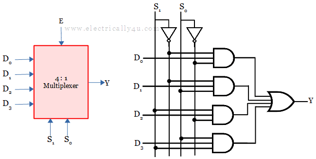
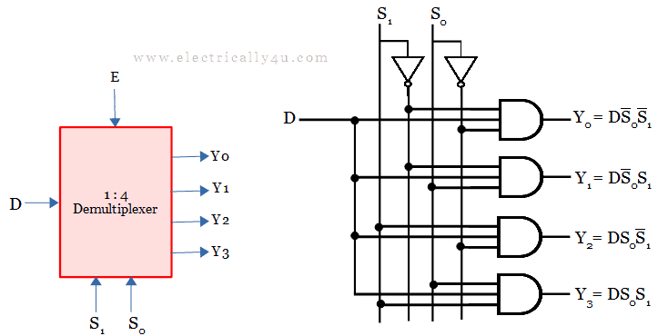
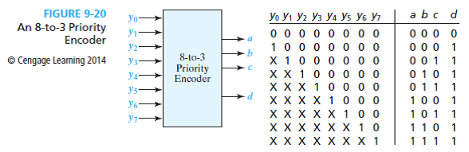

# Lecture
_Job's notebook page 1-4_

## Boolean gates
Symbols in case we forget how to type them:
- AND gate: $\land$
- OR gate: $\lor$
- XOR gate: $\oplus$

## Universal gates
Every other gate can be made using NAND and NOR gates which is quite advantageous as NAND and OR gates are faster and/or smaller than the other gates. E.g. try to make a NOT gat using a single NAND gate.

Also keep in mind: less gates is faster!

## DeMorgan laws
1. $\overline{a\cdot b} = \overline{a} + \overline{b}$
2. $\overline{a+b} = \overline{a} \cdot \overline{b}$er{a+b} = f$

Try applying them in a circuit.

## Various other components:
### Multiplexer:

A multiplexer is used to select which input to use. Using the Selectors (S) the Data (D) stream can be chosen to be forwarded to the output (Y). The number of input streams can be any number. Also see the diagram on how to make a multiplexer.

### Demultiplexer (demux):

A demultiplexer works the opposite way, the selectors are used to select the output of the data stream.

### Priority encoder:

A priority encoder outputs the number of the highest active bit using the output.

## Sum of Products (SOP)
_fyi: teacher was quite adamant that this is important..._

A formula is a SOP if it is a summation (all into an OR gate) of products (AND gates). E.g.:
$$F(a,b,c)=a\cdot b + a\overline{b}c + c$$
Next to that, the second term in this formula has all the inputs in that term. This is called the minterm. This is used later for simplification.

A SOP can easily be converted to using only NAND and NOR gates by inverting the ouptut of the AND gate and again inverting it before it enters the NOR gate.

## Karnaugh map
A Karnaugh map is used to represent a truth table in a different way, in such a way that simplifying to a SOP is very easy.

_work in progress, see Jobs notes_