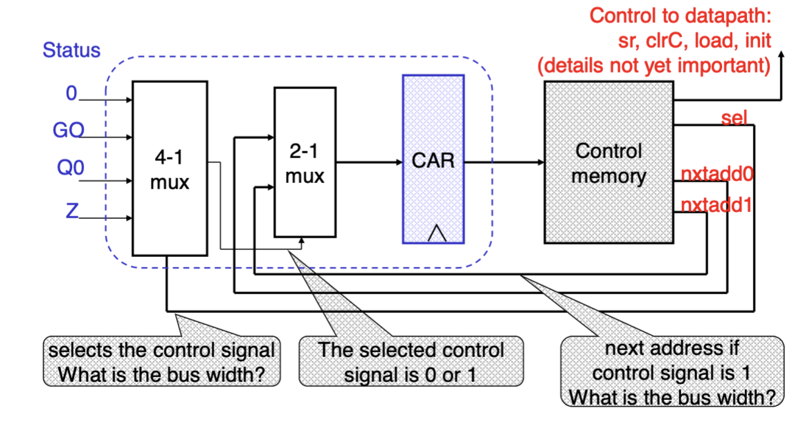

# Lecture 2022-09-13

## Multiplication
Multiplication happens by looking at the final bit and the zero counter. If the final bit is 1, the processor needs to perform addition, and if the final bit is 0, we shift the bits in order to duplicate it. By combining this with a counter of how often we need to perform the shift (zero counter) we can do multiplication.


The implementation of such a multiplier looks as follows in a simple processor:


The simplified microprogram for the multiplication looks like:
| Address | ntxadd0 | ntxadd1 | SEL | datapath         |
| ------- | ------- | ------- | --- | ---------------- |
| idle    | init    | idle    | Go  | none             |
| init    | -       | mul0    | nxt | init, clrC       |
| mul0    | add     | mul1    | Q0  | none             |
| add     | -       | mul1    | nxt | load             |
| mul1    | idle    | mul0    | Z   | sr_der_cnt, clrC |

So what is the advantage of using microprogramming?
- Systematic
- Changes are made in control memory
- Complex state machines can be implemented

## Register File
A register file is often part of the datapath structure. It stores data. Important is that only two registers can be read at the same time from the register file. In total, the register file has 16 bits. The two output busses are both 8 bits.

## First assembly program
If we want to do the following formula: $S=(A-B)+C$, the assembly program would look as follows:
```assembly
ld A, %R1 ; Load A into the first register
ld B, %R2
ld C, %R3
sub %R1, R2, %R4; ;%R4 <- %R1 - %R2
add %R3, %R4, %R4 ;%R4 <- %R3 + %R4
st Z, %R4 ; write results in Z
```
