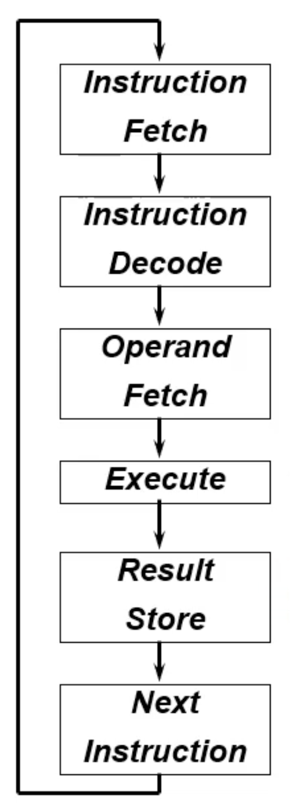

# Lecture 2022 -09-22

## MIPS
In the computer Architecture, the instruction set architecture splits the software and the hardware.

The ISA specifies the steps that the instruction goes trough.

Next to that, the ISA specifies the following:
- Instruction format
- Operations
- Locations of operands and results
- Data type and size
- Next instruction

For a MIPS processor, we have the following specifications:
- Word length = 32 bits
- Register file = 32 registers
- Register width = 32 bits

(Second recording is about examples, just watch it)

## MIPS Single-cycle Processor

The performance of a processor is determined by:
- Instruction Count
- Clock cycles per Instruction (CPI)
- Clock Cycle Time (CCT)

Every instruction starts by fetching the instructions. This is either an R-type of an I-type. These are described in the ISA file that is provided. 

In an I-instruction, the immediate is zero extended to 32 bits or sign extended to 32 bits based on the specification. 

## MIPS Multi-cycle Processor

If we perform an instruction with CPI > 1, we need a multi-cycle processor for performance. The longest CCT is determined by the highest datapath between storage elements. However, we can divide this into more steps with storage elements to allow multi-cycles.
To extend a single-cycle processor to a multi-cycle processor we need a FSM to schedule instructions for the correct cycle. The multi-cycle processor has shorter clock cycles than a single-cycle processor, but is the CPI of a multi-cycle processor is higher. 

To calculate the average CPI of a multi-cycle processor, we need to need the frequency and the load of all instructions.