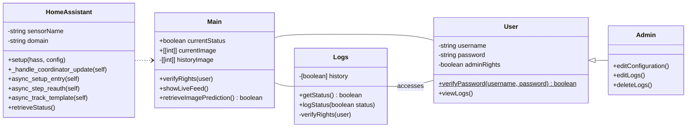

```mermaid
classDiagram
    direction LR
    User <|-- Admin
    HomeAssistant ..> Main
    Main -- Logs
    Main -- User
    Logs -- User : accesses
    class HomeAssistant {
        -string sensorName
        -string domain
        +setup(hass, config)
        +_handle_coordinator_update(self)
        +async_setup_entry(self)
        +async_step_reauth(self)
        +async_track_template(self)
        +retrieveStatus()
    }
    class Main {
        +boolean currentStatus
        +[[int]] currentImage
        -[[int]] historyImage
        +verifyRights(user)
        +showLiveFeed()
        +retrieveImagePrediction() boolean
    }
    class Logs {
        -[boolean] history
        +getStatus() boolean
        +logStatus(boolean status)
        -verifyRights(user)
    }
    class User {
        -string username
        -string password
        -boolean adminRights
        +verifyPassword(username, password)$ boolean
        +viewLogs()
    }
    class Admin {
        +editConfiguration()
        +editLogs()
        +deleteLogs()
    }
```